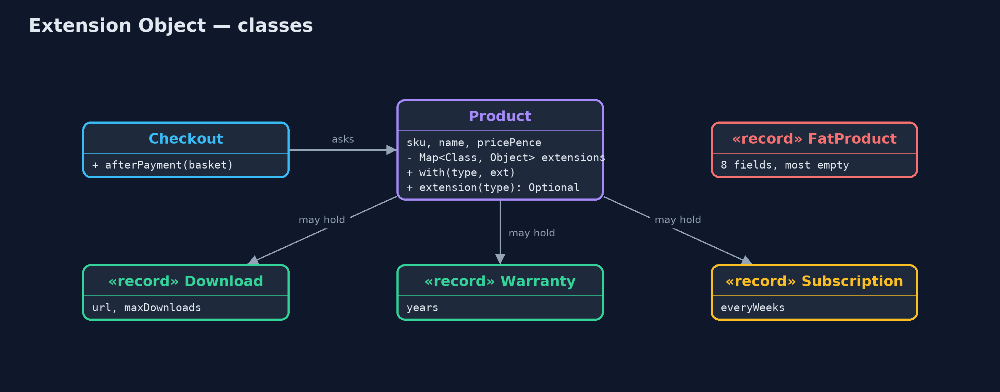
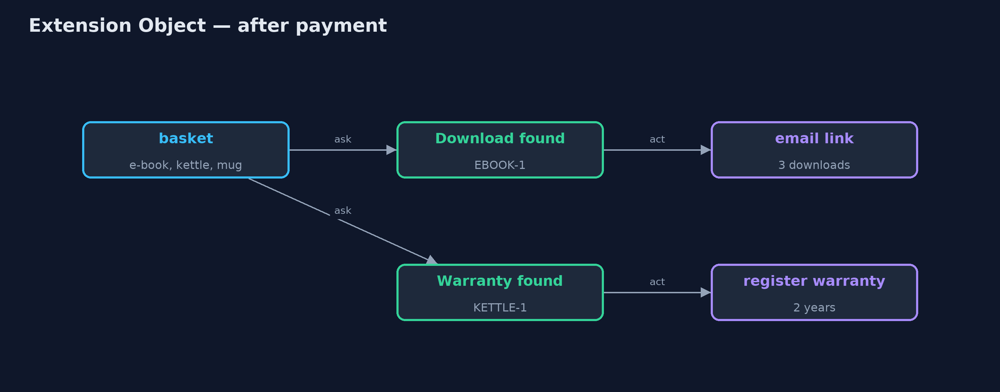
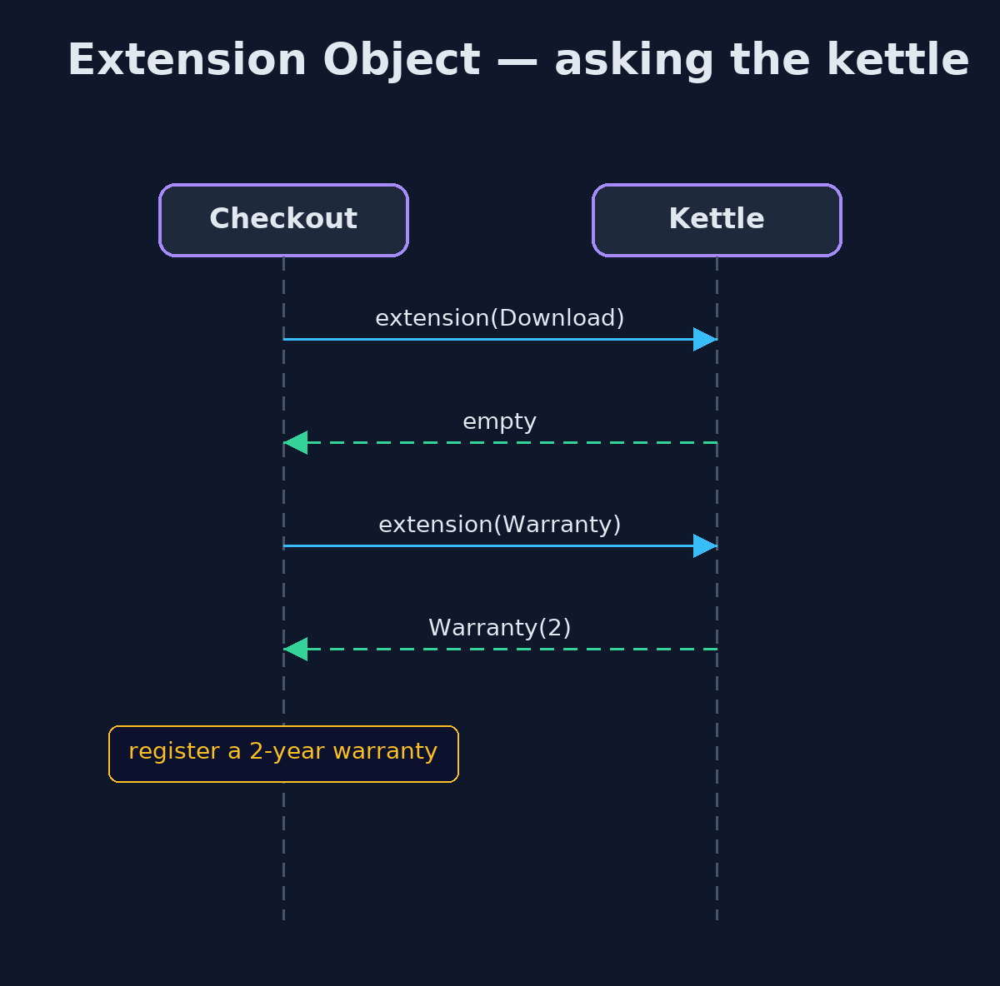

# Extension Object Pattern

```
src/main/java/com/jk/explore/extensionobject/
├── Checkout.java             After payment, asks each product which extra roles it has, and acts on the ones it recognises
├── ExtensionObjectDemo.java  The five acts: the ever-growing product class, extensions, asking for a role, a new role, and the bill
├── Extensions.java           The extra roles a product can take on
├── FatProduct.java           Without the pattern: one product class with a field for every feature any product has ever needed
└── Product.java              The pattern: a small core product that can carry extra roles, looked up by type, added by anyone
```

**Keep the core class small, let other code attach extra roles to individual objects, and let clients ask whether an object has the role they need.**

Extension Object is a pattern for adding new abilities to objects without
changing their class. The core class stays small. Other code attaches extra
roles, called extensions, to individual objects: this product has a warranty,
that one can be downloaded. Code that needs a role asks the object for it by
type, and gets either the extension or an answer that says "not supported".

It stops a central class from growing a field for every feature any object
has ever needed, and lets different teams add their own roles without editing
a class that everyone depends on.

## The idea in everyday terms

Think of a passport. The passport itself holds only the basics: your name,
your photo, your nationality. When you travel, other countries add visas to its
pages, each one issued by a different authority. A border guard does not read
every page; they ask one question: is there a valid visa for here? And no
country ever has to reprint your passport to add its visa.

## The scenario

The online store's product class grew a field for every feature: a download
link and download limit for e-books, a warranty for electricals, gift wrap, an
age limit. A plain mug left most of them empty, and every new feature meant
editing the class the whole shop depends on. Now the subscriptions team wants
to sell coffee beans every four weeks.

## Run

```bash
./gradlew run
```

The demo tells the story in 5 acts, each printing exact numbers that the tests check:

| Act | What it shows |
| --- | --- |
| 1. One class, every field | FatProduct has 8 fields and a mug leaves 5 of them empty; subscriptions would mean a 9th field in the class everyone depends on. |
| 2. A small core, with roles | Product has 3 fields; the e-book carries a Download role, the kettle a Warranty, the mug none. |
| 3. Asking for a role | After payment, checkout asks each product for its roles: it emails the e-book link and registers the kettle's 2-year warranty. |
| 4. A new role | The subscriptions team adds a Subscription role; coffee beans are delivered every 4 weeks, with Product.java unchanged. |
| 5. The bill | An e-book added without its Download role compiles and sells: 0 actions after payment, and the customer gets nothing. |

## Test

```bash
./gradlew test
```

8 tests in `DemoRunsTest`, `ProductTest`. Every number the demo prints is asserted, and nothing depends on the clock, so every run gives the same result.

## Technologies and versions

| Technology | Version | Used for |
| --- | --- | --- |
| Java | 21 | the code (toolchain set in `build.gradle`) |
| Gradle | 9.2.1 (wrapper) | build and run, nothing to install |
| JUnit | 5.10.2 | the tests |
| videokit | repository tool | the narrated video and animation: Piper `en_US-amy-medium`, speed 0.8, longer pauses (the approved `amy-slow` voice) |

## Learning Material

| Document | What it is for |
| --- | --- |
| [Problem statement](docs/problem-statement.md) | the situation and what the project must show |
| [Prerequisites](docs/prerequisites.md) | what you need to know first |
| [Extension Object, explained](docs/extension-object-pattern-explained.md) | the acts in prose |
| [Session guide](docs/session.md) | a one-hour lesson with exercises |
| [Animated walkthrough](docs/animation.html) | the acts step by step, narrated |
| [Spec](docs/spec.md) | what this project must be true of |

### The pattern in one picture

Roles hang off individual products; checkout asks for them by type.


### Where each piece sits

The core product holds roles in a map keyed by type.



### How the data moves

Each role found becomes an action; missing roles are skipped.



### Who calls whom, in order

One lookup per role; an empty answer means "not supported".



### Video

`video/extension-object-pattern-explained.mp4` (with `.m4a` audio and `.srt` subtitles) is built by `video/build_video.sh`. Rendered media is not committed.

## What it costs

- **No compile-time guarantee.** An e-book added without its download role compiles, sells, and delivers nothing.
- **Abilities are hidden.** Reading the product class no longer tells you what a product can do.
- **Lookups by type.** Every client asks "do you have this?" and must handle "no".

## When this is too much

When every object of a class has the same few abilities, ordinary fields and
methods are simpler and checked by the compiler. Extension objects are for
abilities that only some objects have, that keep arriving, and that different
parts of a system own.

## Where you have already met this

- Eclipse's `IAdaptable.getAdapter(Class)`, which asks an object for another role.
- `Optional`-returning lookups such as `unwrap(Class)` in JDBC and JPA.
- Entity-component systems in games, where an entity is a bag of components.
- Product attribute tables in shop platforms, where each product has only the attributes it needs.

## Where this sits

This project is in [foundational-design-patterns](..), next to
[Role Object](../role-object-pattern), which is a close cousin:
there the added roles are objects with their own behaviour, wrapped around a
core.
