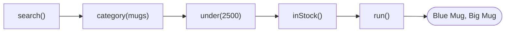

# Fluent Interface Pattern — Architecture Diagram

Each call passes a new query along the chain, until run.

Mermaid source

```mermaid
flowchart LR
    S["search()"] --> C["category(mugs)"] --> U["under(2500)"] --> I["inStock()"] --> R["run()"]
    R --> L(["Blue Mug, Big Mug"])
```

