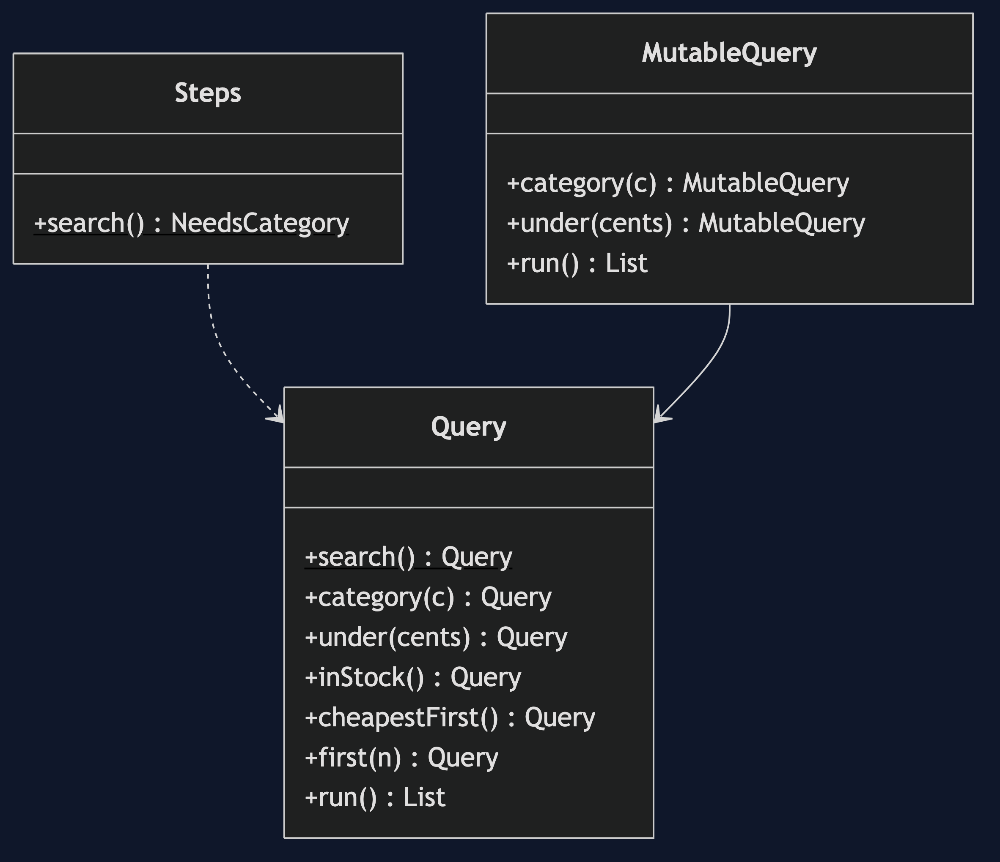
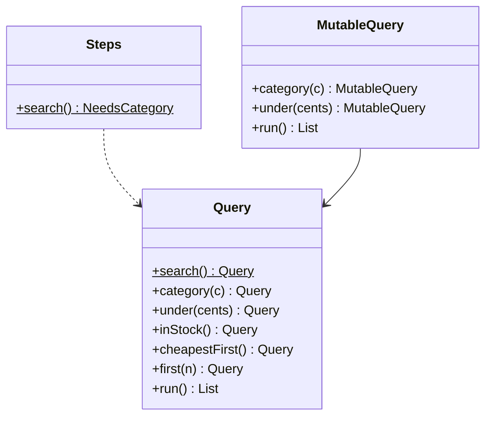

# Fluent Interface Pattern — Class Diagram

A query that returns a new query from every call, and a guided version.

Mermaid source

```mermaid
classDiagram
    class Query {
        +search()$ Query
        +category(c) Query
        +under(cents) Query
        +inStock() Query
        +cheapestFirst() Query
        +first(n) Query
        +run() List
    }
    class MutableQuery {
        +category(c) MutableQuery
        +under(cents) MutableQuery
        +run() List
    }
    class Steps {
        +search()$ NeedsCategory
    }
    Steps ..> Query
    MutableQuery --> Query
```

