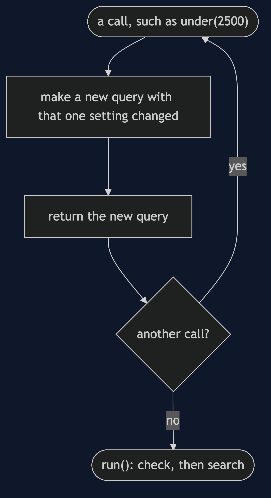
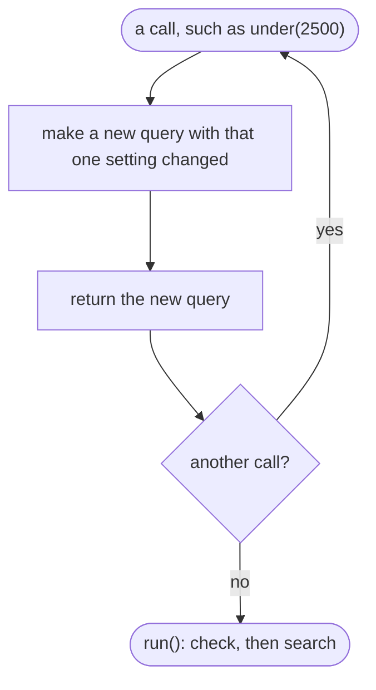

# Fluent Interface Pattern — Data Flow Diagram

What each call in the chain does.

Mermaid source

```mermaid
flowchart TD
    Call(["a call, such as under(2500)"])
    Copy["make a new query with that one setting changed"]
    Ret["return the new query"]
    Next{"another call?"}
    Run(["run(): check, then search"])
    Call --> Copy --> Ret --> Next
    Next -- yes --> Call
    Next -- no --> Run
```

