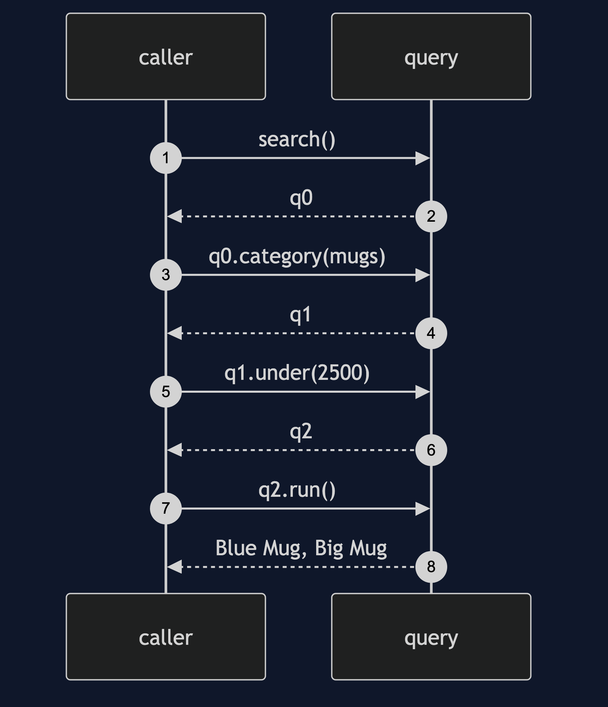
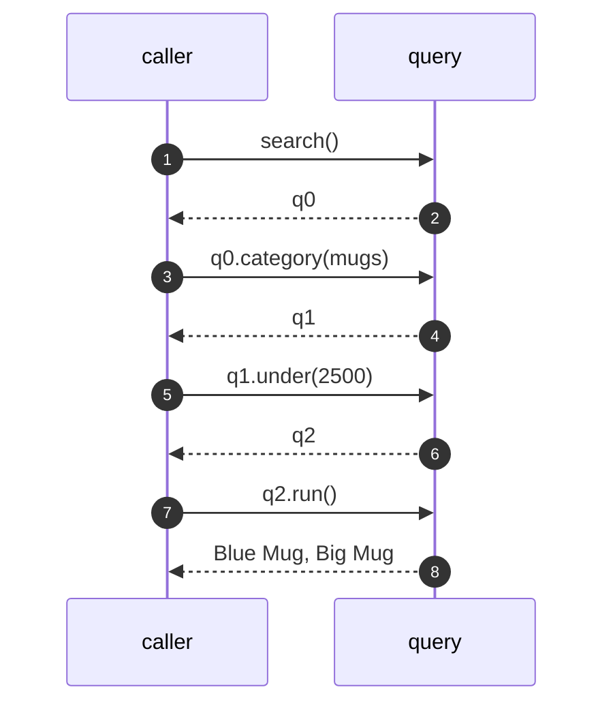

# Fluent Interface Pattern — Sequence Diagram

Written for a listener with the screen off.

Say it in words. The code starts a search. It calls category with mugs, and gets back a new query. It calls under with twenty five hundred on that, and gets another. It calls in stock, and then run. Only at run does the query do any work. Every earlier call only made a new, slightly different query.

Mermaid source

The load-bearing sentence: **each call only makes a new query. Only run does the work.**
