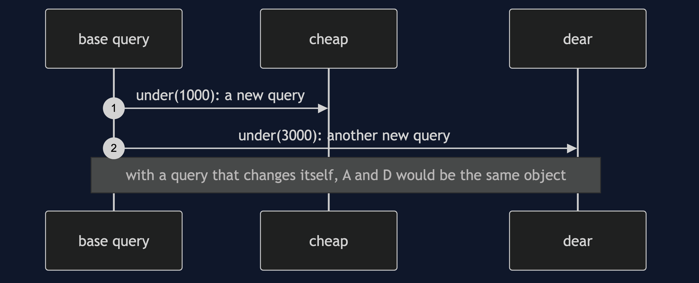
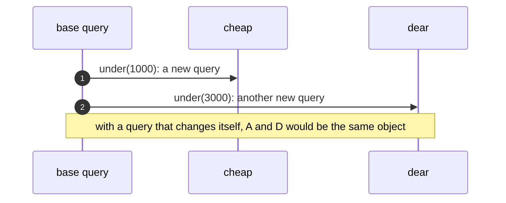

# Fluent Interface Pattern — UML Sequence Diagrams

Four sequences.

## 1. A Shared Base

Mermaid source

```mermaid
sequenceDiagram
    autonumber
    participant B as base query
    participant A as cheap
    participant D as dear
    B->>A: under(1000): a new query
    B->>D: under(3000): another new query
    Note over B,D: with a query that changes itself, A and D would be the same object
```

