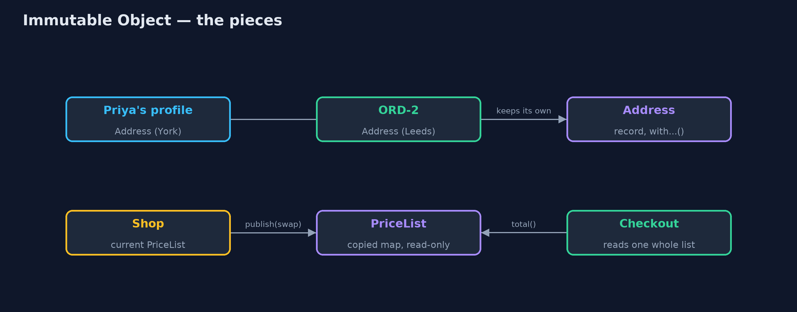
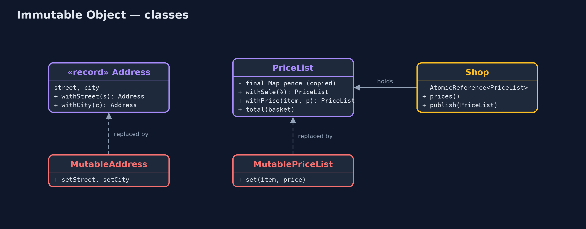
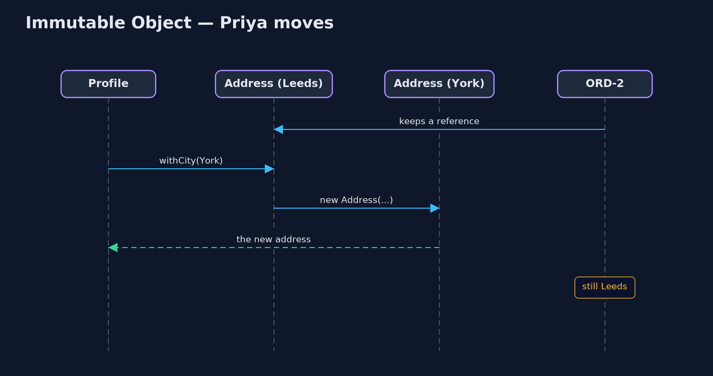

# Immutable Object Pattern

```
src/main/java/com/jk/explore/immutable/
├── Address.java              The pattern: an address that can never change
├── ImmutableObjectDemo.java  The five acts: shared then changed, changed while being read, lost in a set, immutable objects, and the bill
├── MutableAddress.java       Without the pattern: an address with setters, so anyone holding it can change it for everyone
├── MutablePriceList.java     Without the pattern: one price list shared by everyone, changed one price at a time, in place
├── Orders.java               Placed orders that remember where to send the parcel, holding the address object they are handed
├── PriceList.java            The pattern: a price list that never changes once made
└── Shop.java                 Holds the current immutable price list
```

**An object that can never change after it is made can be shared with anyone, read at any moment, and used as a key, because nobody can alter it behind your back.**

An immutable object is one whose state cannot change after it is created. It
has no setters, all its fields are final, and anything it holds that could
change, such as a list or a map, is copied in and handed out read-only. To
"change" it, you make a new object with the difference, and the old one stays
exactly as it was.

That one rule removes a whole family of bugs: objects changed through another
reference, objects seen half-changed, and objects lost inside a hash set. In
Java, a `record` gives you most of it for free.

## The idea in everyday terms

Think of a printed till receipt, and compare it with the whiteboard behind a
café counter. Anyone with a cloth can rub out a price on the whiteboard, and a
customer reading it at that moment might see half the old menu and half the
new. A receipt never changes. If something about your purchase changes, the
shop prints a new receipt, and the old one still says exactly what it said.

## The scenario

The online store passes addresses and price lists around everywhere: an order
keeps the address it ships to, checkout reads the price list, and a set records
addresses with failed deliveries. All of them were ordinary objects with
setters, shared by reference.

## Run

```bash
./gradlew run
```

The demo tells the story in 5 acts, each printing exact numbers that the tests check:

| Act | What it shows |
| --- | --- |
| 1. Shared, then changed | ORD-1 holds Priya's profile address object; she updates her profile, and the placed order now ships to York. |
| 2. Changed while being read | A 10% sale is applied one price at a time; a checkout reading in between totals £62.00, neither £65.00 nor £58.50. |
| 3. Lost in a set | An address in a HashSet has its spelling tidied; the set no longer finds it, though its size is 1. |
| 4. Immutable objects | A new address leaves ORD-2 alone; a sale list is built on the side and swapped in whole (£65.00 then £58.50); copied input and set lookups hold. |
| 5. The bill | Changing 1 price in a 1000-item list makes a new list of 1000 entries; each changeable field needs a with method. |

## Test

```bash
./gradlew test
```

12 tests in `DemoRunsTest`, `ImmutableTest`. Every number the demo prints is asserted, and nothing depends on the clock, so every run gives the same result.

## Technologies and versions

| Technology | Version | Used for |
| --- | --- | --- |
| Java | 21 | the code (toolchain set in `build.gradle`) |
| Gradle | 9.2.1 (wrapper) | build and run, nothing to install |
| JUnit | 5.10.2 | the tests |
| videokit | repository tool | the narrated video and animation: Piper `en_US-amy-medium`, speed 0.8, longer pauses (the approved `amy-slow` voice) |

## Learning Material

| Document | What it is for |
| --- | --- |
| [Problem statement](docs/problem-statement.md) | the situation and what the project must show |
| [Prerequisites](docs/prerequisites.md) | what you need to know first |
| [Immutable Object, explained](docs/immutable-object-pattern-explained.md) | the acts in prose |
| [Session guide](docs/session.md) | a one-hour lesson with exercises |
| [Animated walkthrough](docs/animation.html) | the acts step by step, narrated |
| [Spec](docs/spec.md) | what this project must be true of |

### The pattern in one picture

Holders share immutable objects freely; a change produces a new object, and the shop swaps the price list whole.



### Where each piece sits

The immutable classes have no setters; every change method returns a new object.



### How the data moves

Readers see the old list or the new list; there is no list in between.


### Who calls whom, in order

The profile gets a new address; the order keeps the old one.



### Video

`video/immutable-object-pattern-explained.mp4` (with `.m4a` audio and `.srt` subtitles) is built by `video/build_video.sh`. Rendered media is not committed.

## What it costs

- **Every change is a copy.** Changing one price in a 1000-item list makes a new list of 1000 entries.
- **More methods.** Each field you might change needs a `with...` method that builds the new object.
- **Deep care.** A final field that points at a mutable list is not immutable; the list must be copied in and handed out read-only.
- **Some things must change.** A shopping cart or a counter changes all the time; forcing it to be immutable can make code harder, not easier.

## When this is too much

Objects that exist to be changed, such as a builder, a cart being filled or an
entity tracked by a database library, are usually clearer as mutable objects
with one owner. Make values immutable: addresses, prices, dates, identifiers,
settings, messages.

## Where you have already met this

- `String`, `Integer`, `LocalDate` and `BigDecimal` are all immutable.
- Java `record`s, and `List.of`, `Map.of`, `List.copyOf`.
- The Value Object pattern in domain-driven design.
- Immutable state in React and Redux, and in functional languages.

## Where this sits

This project is in [foundational-design-patterns](..). It is the building block
behind [Value Object](../../domain-driven-design-patterns/value-object-pattern)
and [Money](../../enterprise-design-patterns/money-pattern).
