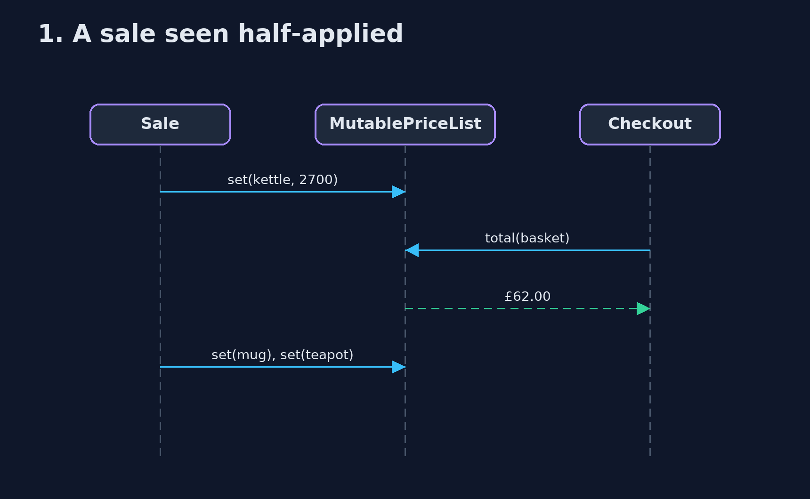
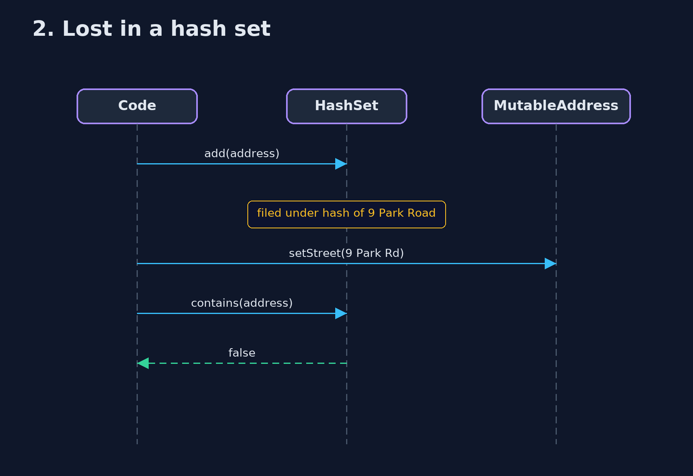

# Immutable Object Pattern — UML Sequence Diagrams

## 1. 1. A sale seen half-applied

Changing a shared list in place lets a reader catch it in between.

## 2. 2. Lost in a hash set

The object moved; its drawer did not.

