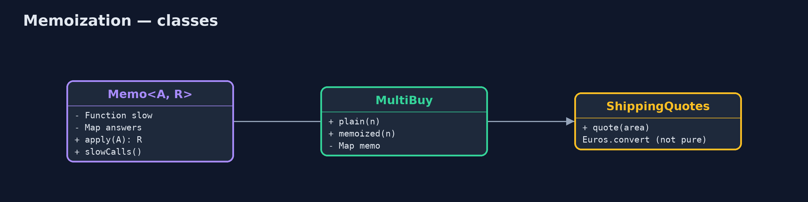
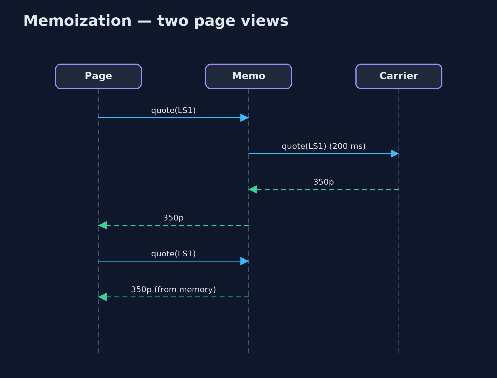

# Memoization Pattern

```
src/main/java/com/jk/explore/memoization/
├── Memo.java             The pattern as a reusable wrapper: remembers the answer for every argument it has seen
├── MemoizationDemo.java  The five acts: the same questions asked again, memoized, a reusable memo, a function that is not safe to memoize, and the bill
├── MultiBuy.java         The cheapest way to buy n mugs with the shop's multi-buy offers: 1 for £4, 2 for £7, 3 for £10, 5 for £15
└── ShippingQuotes.java   A slow shipping quote (a call to the carrier, 200 ms), and an exchange rate that changes during the day
```

**When a function always gives the same answer for the same argument, remember each answer the first time and hand it back after that.**

Memoization means remembering the answer a function gave for an argument, so
the next time it is asked the same question it answers from memory instead of
working it out again. The word comes from "memo", a note to yourself.

It turns some programs from impossibly slow to instant, especially recursive
ones that ask the same smaller questions again and again. It is only correct
for functions whose answer depends on nothing but their argument, and the
memory it uses grows with every new argument.

## The idea in everyday terms

Think of a shop assistant asked "how much is delivery to Leeds?" twenty times a
day. The first time, they phone the courier and wait. Then they write the
answer on a sticky note by the till. After that, they just read the note. The
note is only safe while the courier's price does not change; if it does, the
note is wrong until someone crosses it out.

## The scenario

The online store sells mugs with multi-buy offers: 1 for £4, 2 for £7, 3 for
£10, 5 for £15. Working out the cheapest price for a big order was written as a
plain recursive method, and it took nearly ten million calls for 25 mugs. The
product page also asked the carrier for a shipping quote on every single view,
200 milliseconds each time.

## Run

```bash
./gradlew run
```

The demo tells the story in 5 acts, each printing exact numbers that the tests check:

| Act | What it shows |
| --- | --- |
| 1. The same questions again | The plain recursion finds the best price for 25 mugs, £75.00, after 9,749,473 calls. |
| 2. Memoized | The same method, remembering each answer: £75.00 after 26 calls. |
| 3. A reusable memo | Memo wraps the slow shipping quote: 1000 page views over 12 areas make 12 carrier calls, 2,400 ms instead of 200,000. |
| 4. Not safe to memoize | £100.00 is memoized as €116.00; at noon the rate changes, and the memo still says €116.00 instead of €112.00. |
| 5. The bill | 100,000 different postcodes leave 100,000 answers in memory; real caches add a size limit and expiry. |

## Test

```bash
./gradlew test
```

9 tests in `DemoRunsTest`, `MemoTest`. Every number the demo prints is asserted, and nothing depends on the clock, so every run gives the same result.

## Technologies and versions

| Technology | Version | Used for |
| --- | --- | --- |
| Java | 21 | the code (toolchain set in `build.gradle`) |
| Gradle | 9.2.1 (wrapper) | build and run, nothing to install |
| JUnit | 5.10.2 | the tests |
| videokit | repository tool | the narrated video and animation: Piper `en_US-amy-medium`, speed 0.8, longer pauses (the approved `amy-slow` voice) |

## Learning Material

| Document | What it is for |
| --- | --- |
| [Problem statement](docs/problem-statement.md) | the situation and what the project must show |
| [Prerequisites](docs/prerequisites.md) | what you need to know first |
| [Memoization, explained](docs/memoization-pattern-explained.md) | the acts in prose |
| [Session guide](docs/session.md) | a one-hour lesson with exercises |
| [Animated walkthrough](docs/animation.html) | the acts step by step, narrated |
| [Spec](docs/spec.md) | what this project must be true of |

### The pattern in one picture

Look in the memo first; only on a miss call the slow function.


### Where each piece sits

A generic wrapper, and a hand-memoized recursion.



### How the data moves

Each smaller answer is worked out once and reused.


### Who calls whom, in order

The second view is answered from memory.



### Video

`video/memoization-pattern-explained.mp4` (with `.m4a` audio and `.srt` subtitles) is built by `video/build_video.sh`. Rendered media is not committed.

## What it costs

- **Only for pure functions.** If the answer depends on anything besides the argument, such as the time or an exchange rate, the memo goes stale.
- **Memory grows.** A memo never forgets: 100,000 postcodes means 100,000 answers kept.
- **Keys must be good keys.** The argument must have a correct `equals` and `hashCode`, and must not change after it is stored.

## When this is too much

When a function is cheap, or is rarely called twice with the same argument,
remembering answers costs memory and gains nothing. And when answers go out of
date, use a real cache with an expiry time and a size limit rather than a plain
memo.

## Where you have already met this

- `Map.computeIfAbsent`, the one-line way to memoize in Java.
- Dynamic programming in algorithm courses, which is memoization of recursive problems.
- Caching libraries such as Caffeine, which add size limits and expiry.
- `useMemo` in React, and `@Cacheable` in Spring.

## Where this sits

This project is in [foundational-design-patterns](..). The
[Cache-Aside](../../micro-services-design-patterns/cache-aside-pattern)
pattern is the same idea applied to data stored in another service, with
expiry built in.
