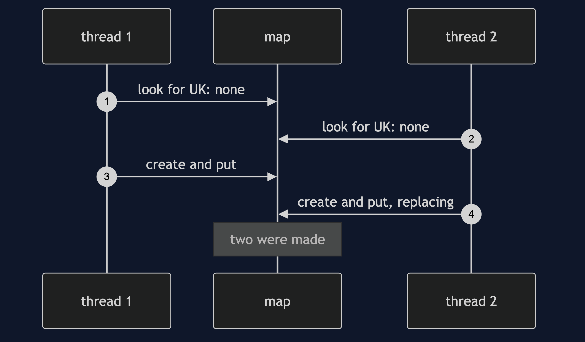

# Multiton Pattern

```
src/main/java/com/jk/explore/multiton/
├── MultitonDemo.java                the six acts
├── Warehouse.java                   one instance per region, made once
│
└── NaiveWarehouses.java             looks first, creates second, no lock
```

**Multiton: one instance per key, always the same one for the same key.**

This project is in [foundational-design-patterns](..). It is [Singleton](../../creational/singleton-pattern) with a key, and it is what a [Registry](../registry-pattern) becomes when the registry creates its own entries.

## Run

```bash
./gradlew run
```

Six acts. Every number quoted below comes from this program's own output.

```
ONE. A new one each time.
  two callers each made a UK warehouse. same object: false. A has stock 90, B has 100.
  the shop now believes two different things about one warehouse.
TWO. One per region.
  asked for UK twice: same object: true. asked for EU: same as UK: false. created so far: 2.
THREE. Shared, so they agree.
  one part of the shop reserved 10 in the UK. another part, asking for UK, sees stock 90. the EU warehouse has 100.
FOUR. A fixed set of keys.
  asked for MARS: refused, "no warehouse in MARS". instances held: 3.
FIVE. Two threads, one region.
  look first, create second, no lock: both threads looked before either created. same object: false. created: 2.
  with an atomic create-if-absent: 8 threads at once, same object: true. created: 1.
SIX. The bill.
  one test reserved 30. the next test starts, and asks for UK: stock 70, not 100. state leaks from one test to the next.
  the instances live as long as the program does: held 1, and nothing ever lets one go.
  and any code can reach any warehouse from anywhere, so who changed the stock is hard to say.
```

## Test

```bash
./gradlew test
```

2 test classes, 7 test methods, offline, with nothing installed and no framework.

## Technologies and versions

| What | Version | Why it is here |
| --- | --- | --- |
| Java | 21 | The repository standard, via the Gradle toolchain block |
| Gradle | 9.2.1 | The wrapper in this directory; no separate install needed |
| JUnit 5 | 5.10.2 | Test runner |

No framework. A hand-built project stays plain Java so the mechanism is the whole lesson.

## Learning Material

| Document | What it covers |
| --- | --- |
| [`docs/problem-statement.md`](docs/problem-statement.md) | The scenario, and the problem |
| [`docs/multiton-pattern-explained.md`](docs/multiton-pattern-explained.md) | The pattern, and six acts |
| [`docs/class-diagram.md`](docs/class-diagram.md) | The types |
| [`docs/architecture-diagram.md`](docs/architecture-diagram.md) | The parts and how they connect |
| [`docs/data-flow-diagram.md`](docs/data-flow-diagram.md) | What happens to one request |
| [`docs/sequence-diagram.md`](docs/sequence-diagram.md) | Written for a listener with the screen off |
| [`docs/uml-diagram.md`](docs/uml-diagram.md) | Four sequences |
| [`docs/animation.html`](docs/animation.html) | The six acts in a browser |
| [`docs/prerequisites.md`](docs/prerequisites.md) | What you need to know |
| [`docs/session.md`](docs/session.md) | A one-hour taught session |
| [`docs/spec.md`](docs/spec.md) | The generated specification |
| [`docs/youtube.md`](docs/youtube.md) | Title, description and chapters |

### The pattern in one picture


### Where each piece sits


### How one request moves


### Who calls whom, in order


### All four sequences




### Video

Built from [`video/scenes.py`](video/scenes.py) by
[`video/build_video.sh`](video/build_video.sh). The rendered file is not
committed; see the repository README for why.

## Where you have already met this

`java.util.Currency`, logger factories that return one logger per name, and enum constants.

## When this is too much

If an enum can name the fixed set, use an enum. If the object can be passed in, pass it in. A multiton is global state with a key.

## Where this sits

This project is in [`foundational-design-patterns`](..), and is meant to be read with its neighbours there.
