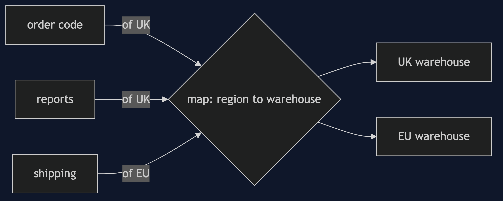
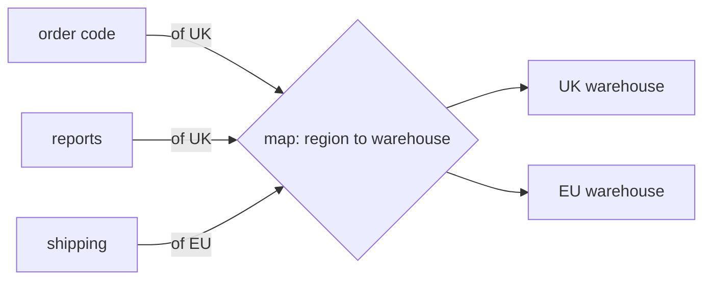

# Multiton Pattern — Architecture Diagram

Callers ask by key. The map holds one instance for each.

Mermaid source

```mermaid
flowchart LR
    A["order code"] -->|of UK| M{"map: region to warehouse"}
    B["reports"] -->|of UK| M
    C["shipping"] -->|of EU| M
    M --> UK["UK warehouse"]
    M --> EU["EU warehouse"]
```

