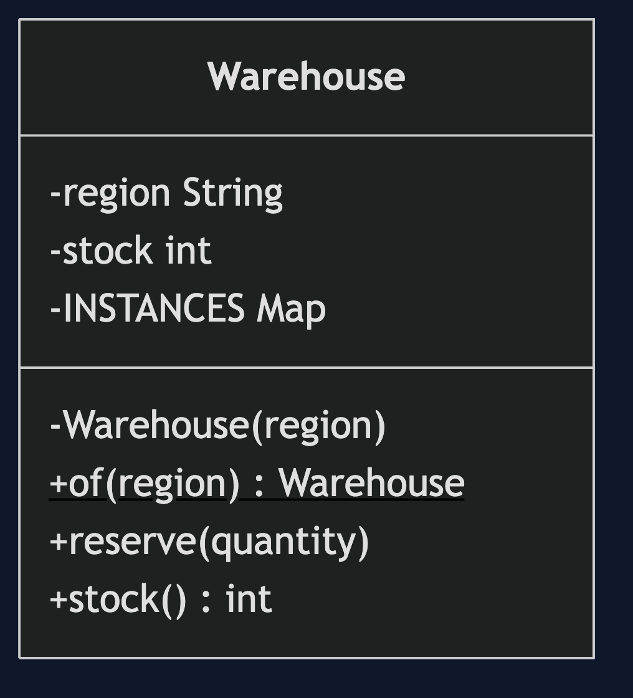
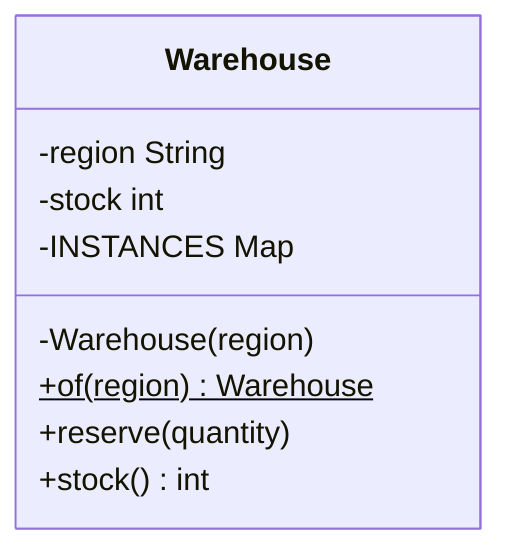

# Multiton Pattern — Class Diagram

A class that keeps one instance for each region.

Mermaid source

```mermaid
classDiagram
    class Warehouse {
        -region String
        -stock int
        -INSTANCES Map
        -Warehouse(region)
        +of(region)$ Warehouse
        +reserve(quantity)
        +stock() int
    }
```

