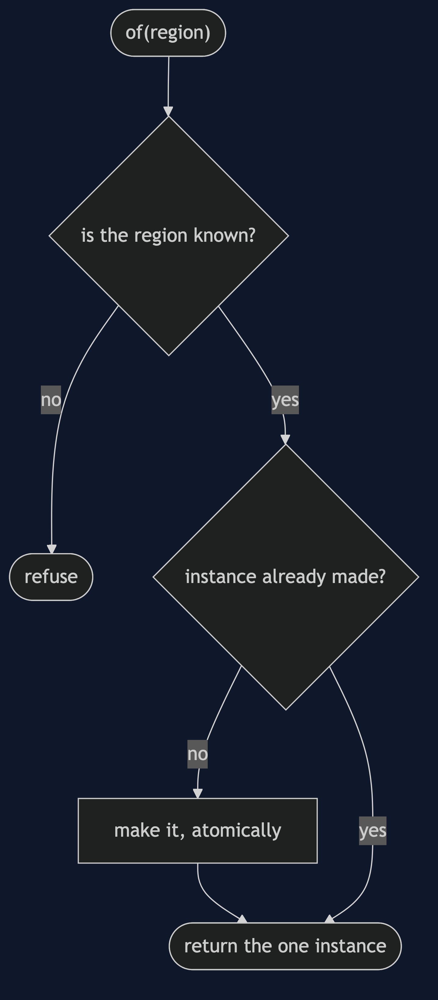
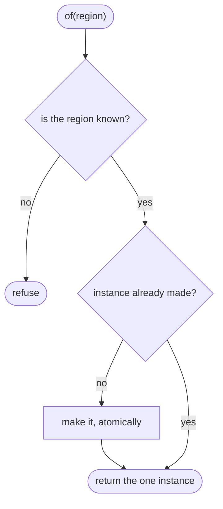

# Multiton Pattern — Data Flow Diagram

What of(region) does.

Mermaid source

```mermaid
flowchart TD
    Ask(["of(region)"])
    Known{"is the region known?"}
    Refuse(["refuse"])
    Have{"instance already made?"}
    Make["make it, atomically"]
    Return(["return the one instance"])
    Ask --> Known
    Known -- no --> Refuse
    Known -- yes --> Have
    Have -- no --> Make --> Return
    Have -- yes --> Return
```

