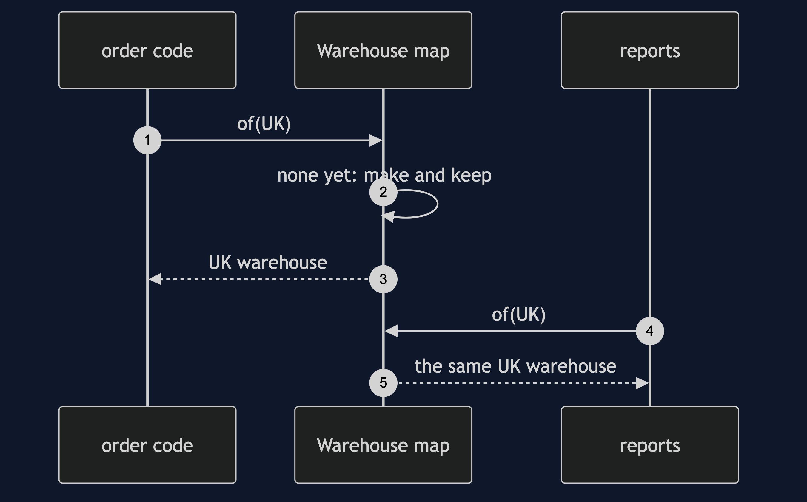
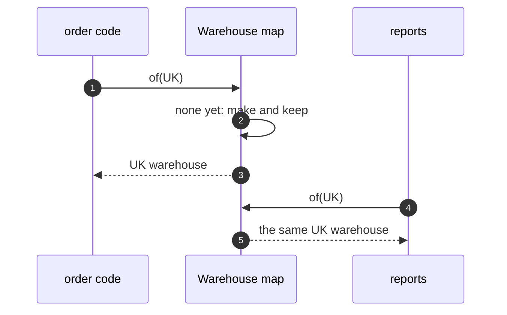

# Multiton Pattern — Sequence Diagram

Written for a listener with the screen off.

Say it in words. The order code asks for the UK warehouse. The map has none, so it makes one and keeps it. The reports code asks for the UK warehouse. The map has one, and returns the same object. Both now see the same stock.

Mermaid source

The load-bearing sentence: **the first ask makes it, and every ask after gets the same one.**
