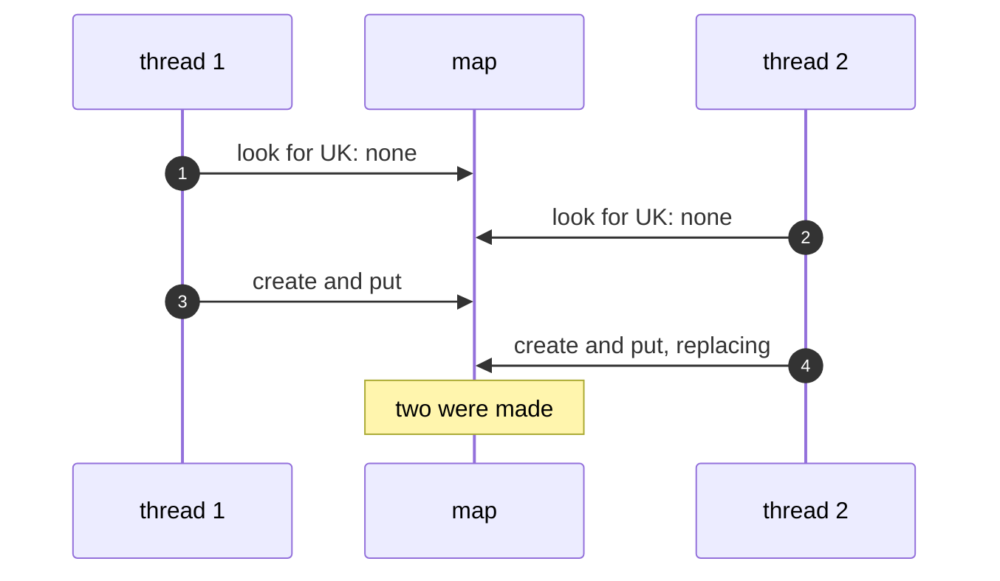

# Multiton Pattern — UML Sequence Diagrams

Four sequences.

## 1. The Race

Mermaid source

```mermaid
sequenceDiagram
    autonumber
    participant T1 as thread 1
    participant M as map
    participant T2 as thread 2
    T1->>M: look for UK: none
    T2->>M: look for UK: none
    T1->>M: create and put
    T2->>M: create and put, replacing
    Note over M: two were made
```

