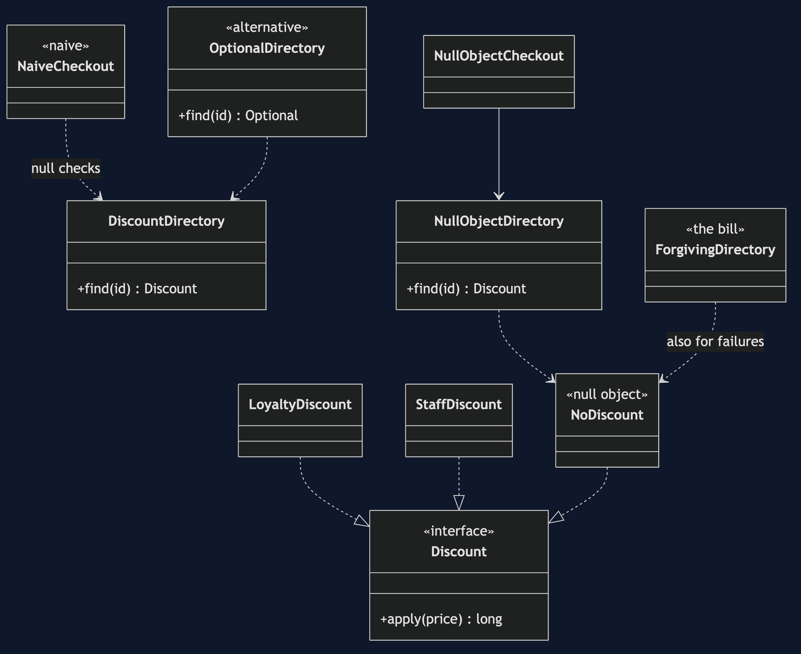
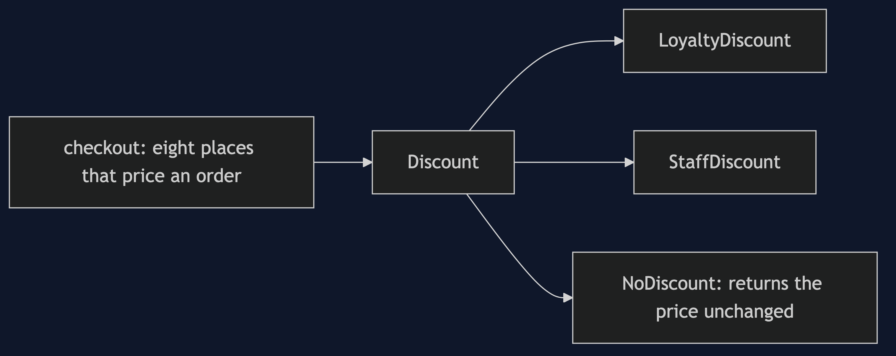
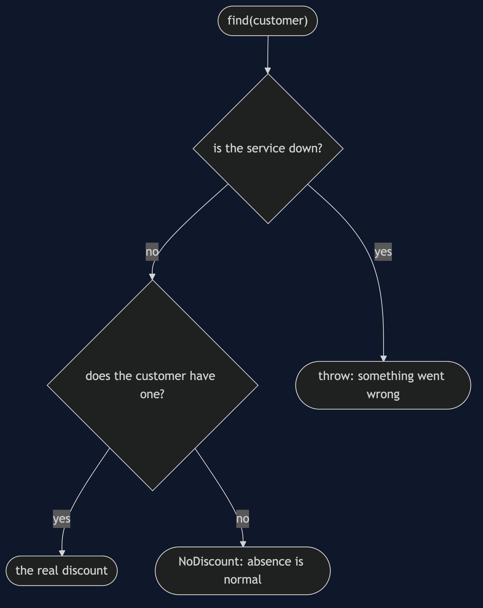
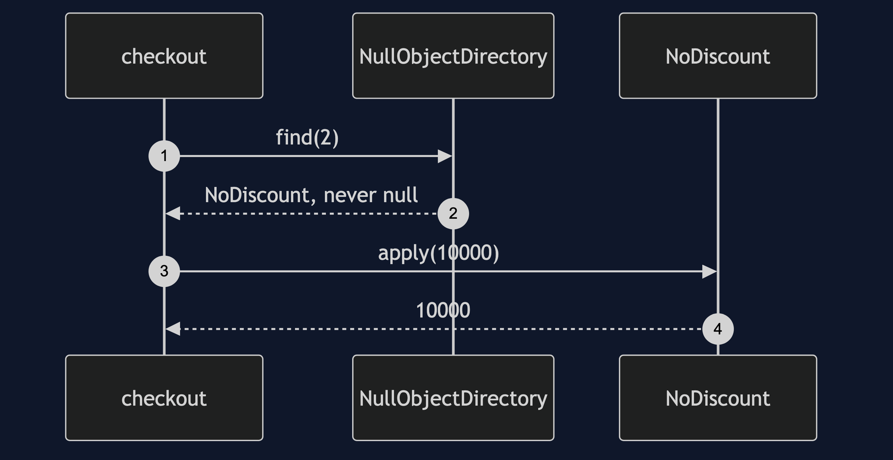

# Null Object Pattern

```
src/main/java/com/jk/explore/nullobject/
├── DiscountDemo.java                composition root — the six acts
│
├── domain/
│   ├── Discount.java                 what a discount does to a price
│   ├── LoyaltyDiscount.java  StaffDiscount.java
│   ├── DiscountDirectory.java        who has which discount; returns null for "none"
│   └── DiscountServiceDown.java      not the same thing as "no discount"
├── naive/
│   └── NaiveCheckout.java            eight methods; seven check for null, one forgot
│
└── pattern/                         ← the real thing
    ├── NoDiscount.java               the null object
    ├── NullObjectDirectory.java  NullObjectCheckout.java
    ├── ForgivingDirectory.java       the bill: an error turned into "no discount"
    └── OptionalDirectory.java        the fair alternative
```

**A null object implements the same interface and does nothing, so callers never have to check for absence.**

This is the first project in [foundational-design-patterns](..). The category's subject is how an object gets hold of another, and what happens when there is not one. Null Object answers the second half. It is also the one project that partly argues against its own title: `Optional` is often the better answer, and the project says when.

## Run

```bash
./gradlew run
```

Six acts. Prices are in pence: a 10,000 pence order is one hundred pounds.

```
NULL OBJECT — the discount that is not there

ONE. find() returns null, and every caller checks.
  customer 1 (loyalty), 10000 pence: total 9000, invoice 9000
  customer 2 (no discount):          total 10000, invoice 10000
  the eighth place to price an order, taxBase, for customer 2:
  NullPointerException at checkout. it was added last, and the check was forgotten.

TWO. The check you stop seeing.
  NaiveCheckout has 8 methods that price an order after a discount.
  "if (discount != null)" appears 7 times. the eighth method is the one without it.
  seven identical blocks: a reader stops seeing them, so the missing one hides in plain sight.

THREE. The pattern — a discount that does nothing.
  every null check deleted. the same customers, the same prices:
  customer 1: 9000 pence  (same as before)
  customer 2: 10000 pence  (same as before)
  customer 3: 7500 pence  (same as before)
  customer 4: 10000 pence  (same as before)
  and taxBase for customer 2 now returns 10000, not an exception.

FOUR. The bill — a null object can hide an error.
  the plain null object lets the outage through: the discount service is down
  now a directory that turns any failure into "no discount":
  customer 1, entitled to loyalty, charged 10000 pence instead of 9000. no error, no log, no alert.
  "no discount" and "the service was down" now look the same. that is a quieter, worse bug than the exception.

FIVE. The two honest alternatives.
  Optional: customer 1 has one: true, customer 2 has one: false. absence is in the type, and the caller must decide.
  and a service that is down is still a failure, not an empty Optional: the discount service is down
  explicit failure: when absence means something went wrong, throw.

SIX. The verdict.
  use a null object when absence is a legitimate domain state: no discount is normal.
  never use one to hide a failure. prefer Optional where the caller must decide.
  where you have met this in code you did not write: Collections.emptyList(),
  InputStream.nullInputStream(), and a no-op logger.
```

## Test

```bash
./gradlew test
```

2 test classes, 9 test methods, offline, with nothing installed and no framework.

## Technologies and versions

| What | Version | Why it is here |
| --- | --- | --- |
| Java | 21 | The repository standard, via the Gradle toolchain block |
| Gradle | 9.2.1 | The wrapper in this directory; no separate install needed |
| JUnit 5 | 5.10.2 | Test runner |

No framework. A hand-built project stays plain Java so the mechanism is the whole lesson.

## Learning Material

| Document | What it covers |
| --- | --- |
| [`docs/problem-statement.md`](docs/problem-statement.md) | The discount, and the check that was forgotten |
| [`docs/null-object-pattern-explained.md`](docs/null-object-pattern-explained.md) | The pattern, the bill, the alternatives, and the verdict |
| [`docs/class-diagram.md`](docs/class-diagram.md) | The types |
| [`docs/architecture-diagram.md`](docs/architecture-diagram.md) | One interface, three discounts |
| [`docs/data-flow-diagram.md`](docs/data-flow-diagram.md) | One lookup: a discount, nothing, or a failure |
| [`docs/sequence-diagram.md`](docs/sequence-diagram.md) | Written for a listener with the screen off |
| [`docs/uml-diagram.md`](docs/uml-diagram.md) | Four sequences |
| [`docs/animation.html`](docs/animation.html) | The six acts in a browser |
| [`docs/prerequisites.md`](docs/prerequisites.md) | What you need to know |
| [`docs/session.md`](docs/session.md) | A one-hour taught session |
| [`docs/spec.md`](docs/spec.md) | The generated specification |
| [`docs/youtube.md`](docs/youtube.md) | Title, description and chapters |

### The pattern in one picture



### Where each piece sits



### How one request moves



### Who calls whom, in order



### All four sequences


### Video

Built from [`video/scenes.py`](video/scenes.py) by
[`video/build_video.sh`](video/build_video.sh). The rendered file is not
committed; see the repository README for why.

## Where you have already met this

Every time you returned an empty list instead of `null`, you used it. `Collections.emptyList()` and `InputStream.nullInputStream()` are null objects.

## When this is too much

For a value with one call site, a null check is simpler. It earns its place when the same check would be repeated and absence is normal.

## Where this sits

This is the first of five projects in [`foundational-design-patterns`](..). The last three, Registry, Service Locator and Dependency Injection, are one argument in three moves.
