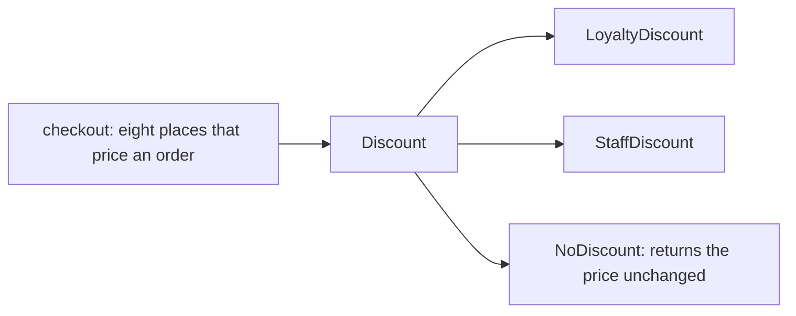

# Null Object Pattern — Architecture Diagram

Callers see one interface, whichever discount is behind it.

Mermaid source

```mermaid
flowchart LR
    C["checkout: eight places that price an order"] --> I["Discount"]
    I --> L["LoyaltyDiscount"]
    I --> S["StaffDiscount"]
    I --> N["NoDiscount: returns the price unchanged"]
```

