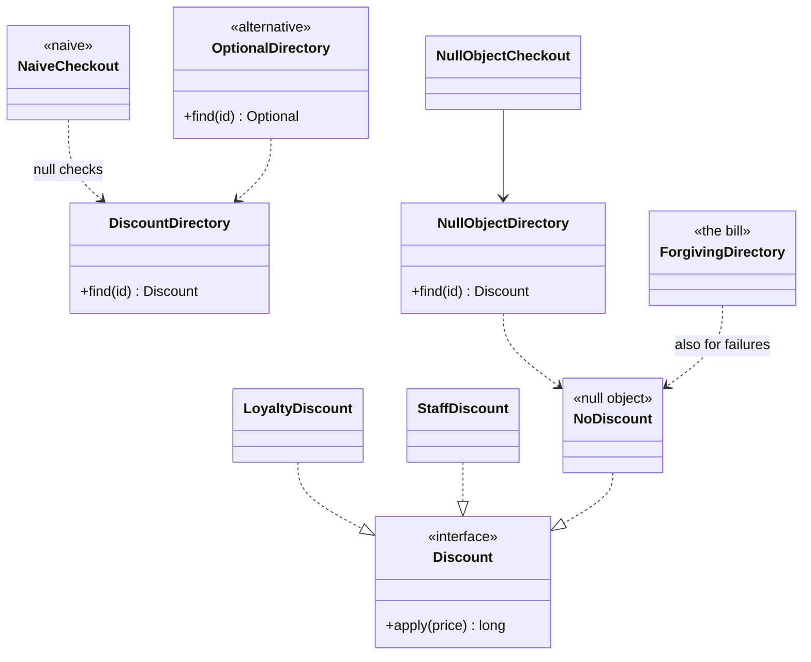

# Null Object Pattern — Class Diagram

`NoDiscount` is one more `Discount`. Nothing else changes.

Mermaid source

```mermaid
classDiagram
    class Discount {
        <<interface>>
        +apply(price) long
    }
    class LoyaltyDiscount
    class StaffDiscount
    class NoDiscount {
        <<null object>>
    }
    class DiscountDirectory {
        +find(id) Discount
    }
    class NaiveCheckout {
        <<naive>>
    }
    class NullObjectDirectory {
        +find(id) Discount
    }
    class NullObjectCheckout
    class ForgivingDirectory {
        <<the bill>>
    }
    class OptionalDirectory {
        <<alternative>>
        +find(id) Optional
    }
    LoyaltyDiscount ..|> Discount
    StaffDiscount ..|> Discount
    NoDiscount ..|> Discount
    NaiveCheckout ..> DiscountDirectory : null checks
    NullObjectDirectory ..> NoDiscount
    NullObjectCheckout --> NullObjectDirectory
    ForgivingDirectory ..> NoDiscount : also for failures
    OptionalDirectory ..> DiscountDirectory
```

