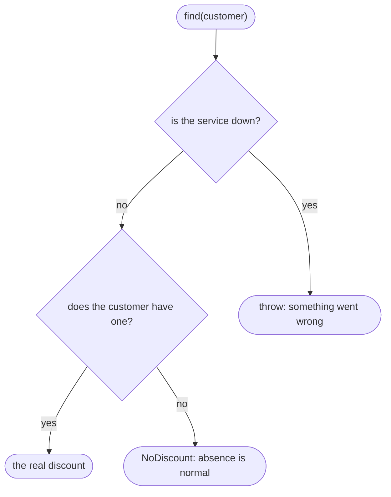

# Null Object Pattern — Data Flow Diagram

One lookup: a discount, a null object, or a failure that must not be hidden.

Mermaid source

```mermaid
flowchart TD
    Ask(["find(customer)"])
    Down{"is the service down?"}
    Has{"does the customer have one?"}
    Fail(["throw: something went wrong"])
    Real(["the real discount"])
    Null(["NoDiscount: absence is normal"])
    Ask --> Down
    Down -- yes --> Fail
    Down -- no --> Has
    Has -- yes --> Real
    Has -- no --> Null
```

