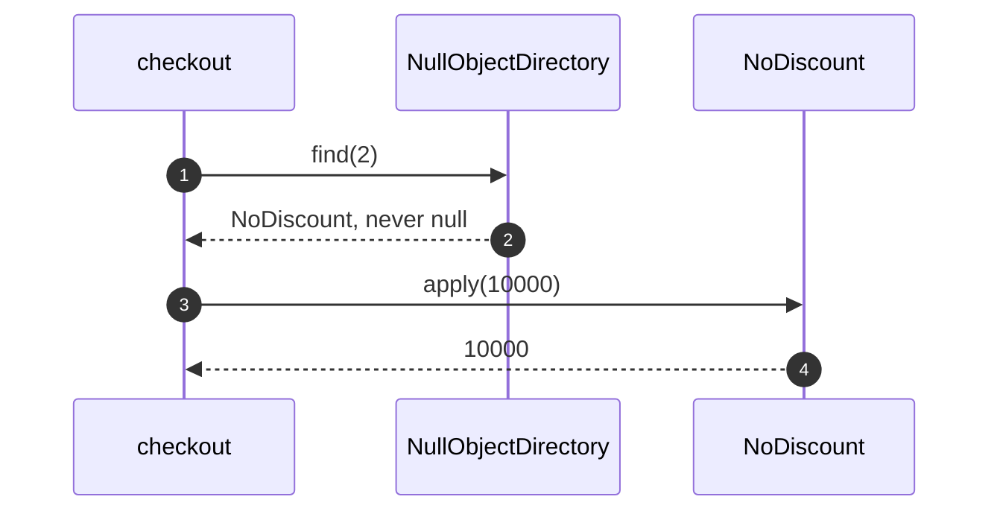

# Null Object Pattern — Sequence Diagram

Written for a listener with the screen off.

Say it in words. The checkout asks the directory for customer two's discount. That customer has none, so the directory hands back the no-discount object rather than null. The checkout calls apply on it, exactly as it would on a real discount, and gets the price back unchanged. There is no check anywhere. If the service had been down, the directory would have thrown instead, and the checkout would have failed loudly.

Mermaid source

The load-bearing sentence: **absence is normal, and a failure is not absence.**
