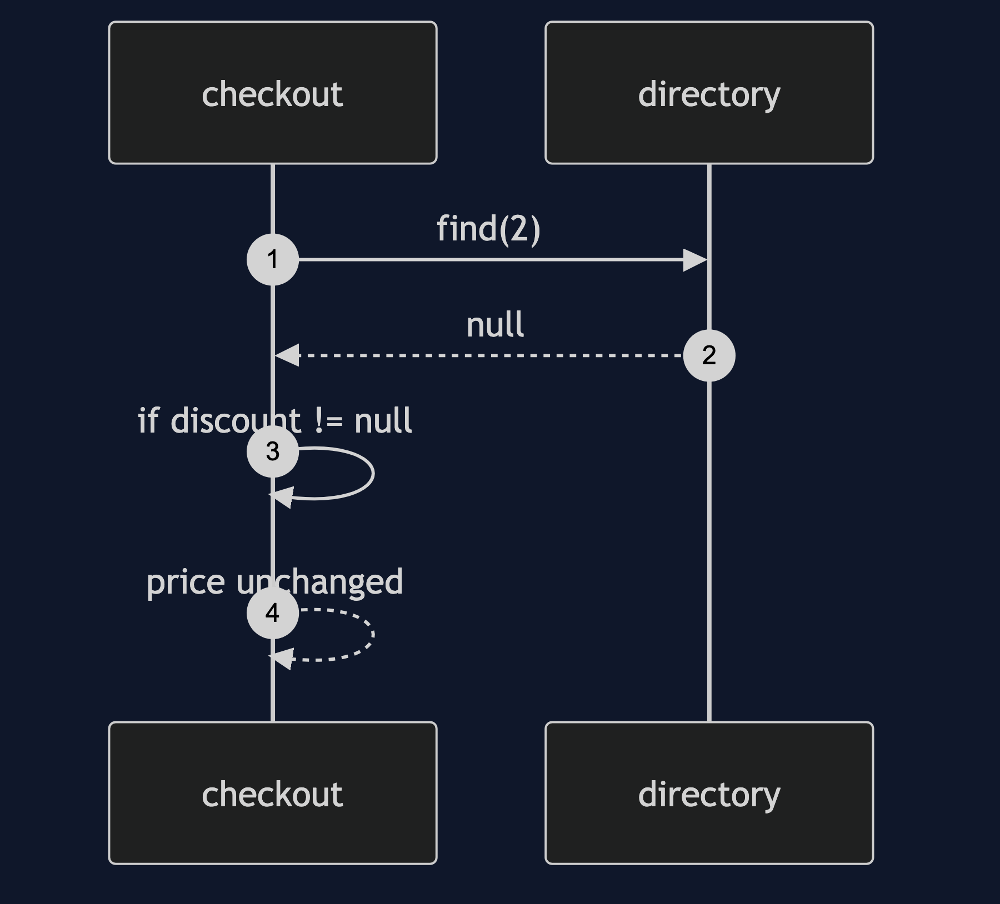
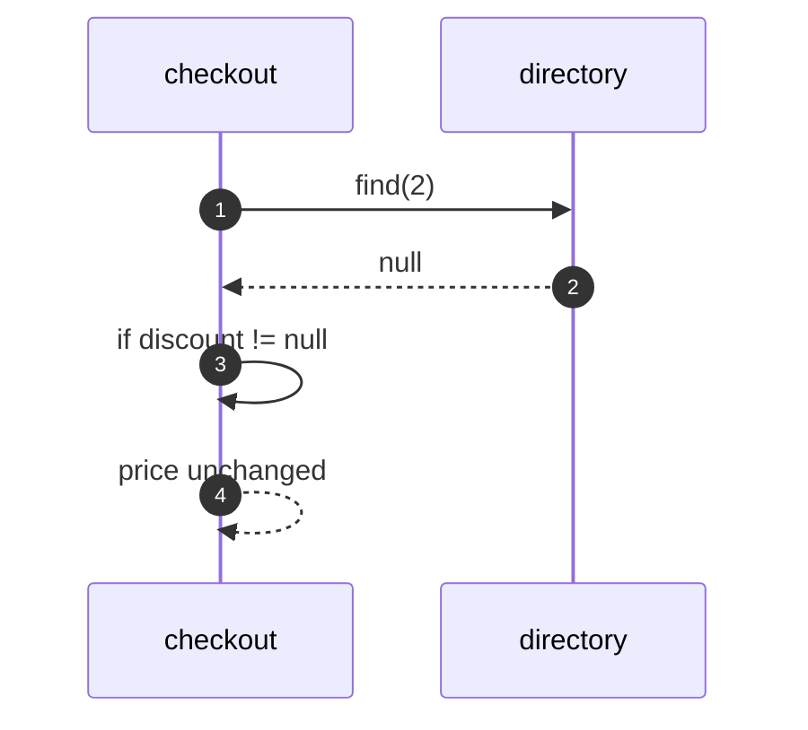
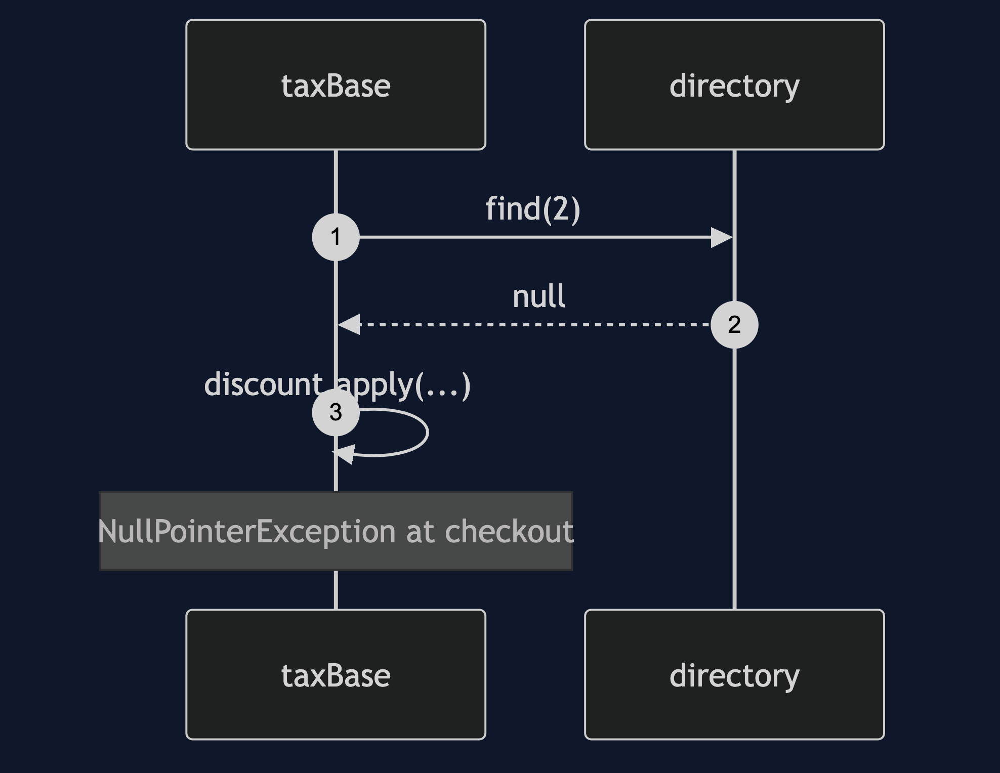
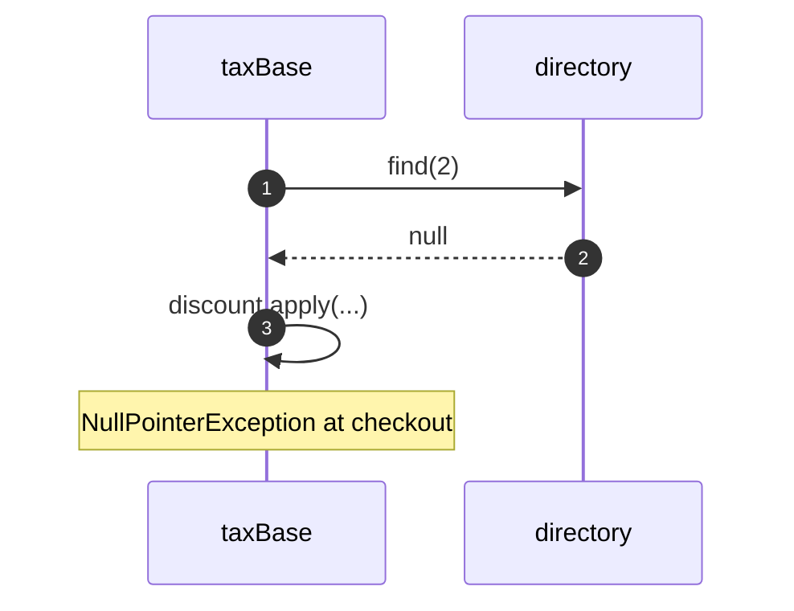
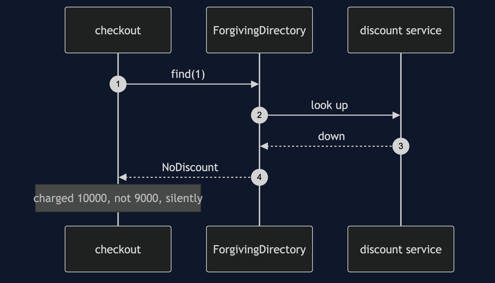
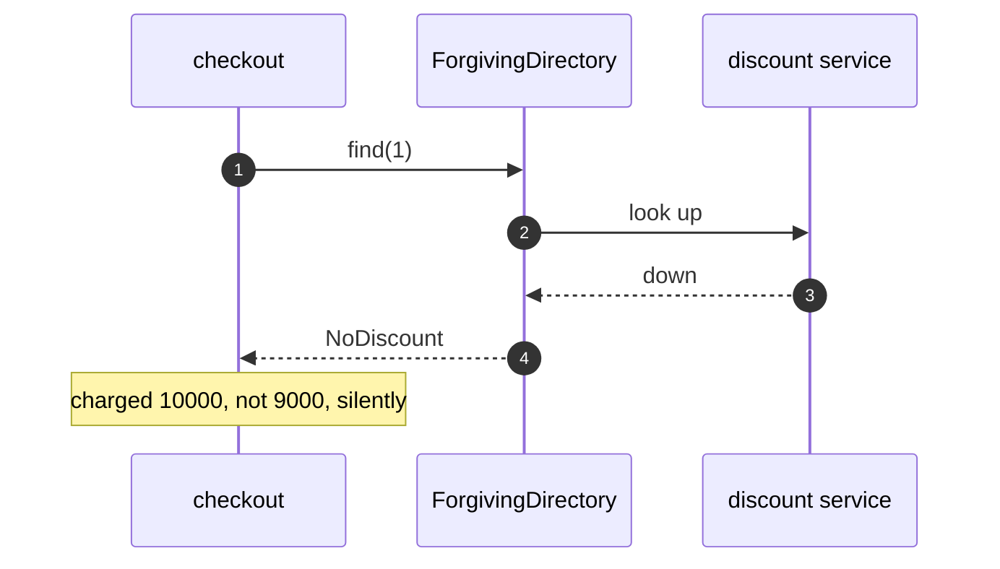
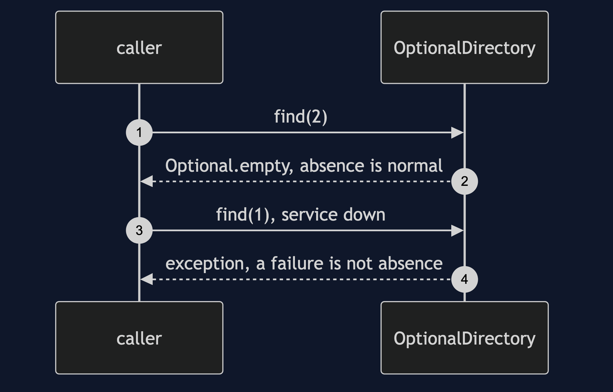
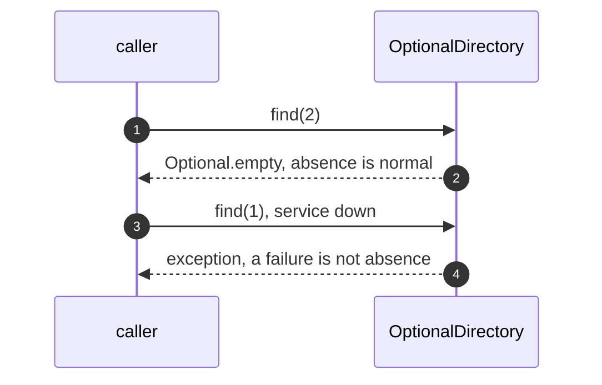

# Null Object Pattern — UML Sequence Diagrams

Four sequences.

## 1. A Null Check

Mermaid source

## 2. The Forgotten Check

Mermaid source

## 3. A Failure Turned Into Full Price

Mermaid source

## 4. Optional Keeps Them Apart

Mermaid source

