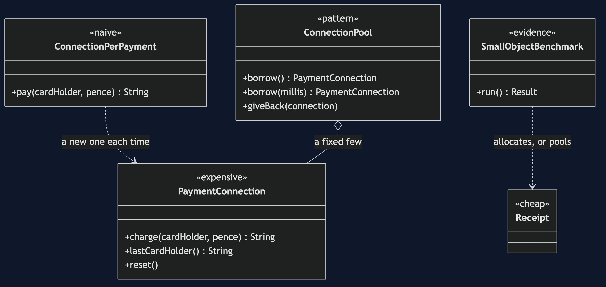
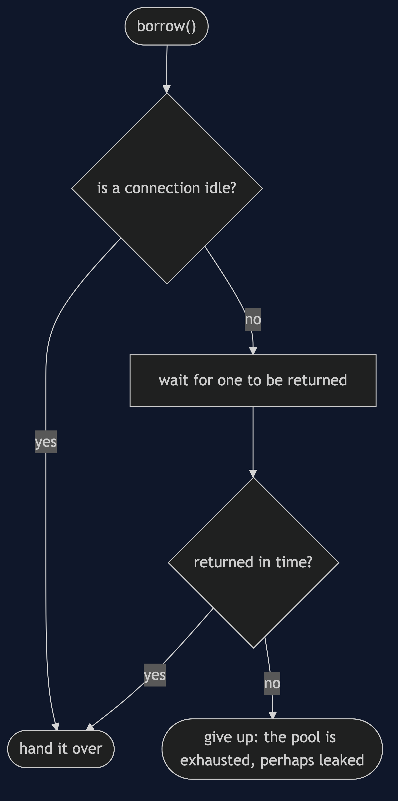
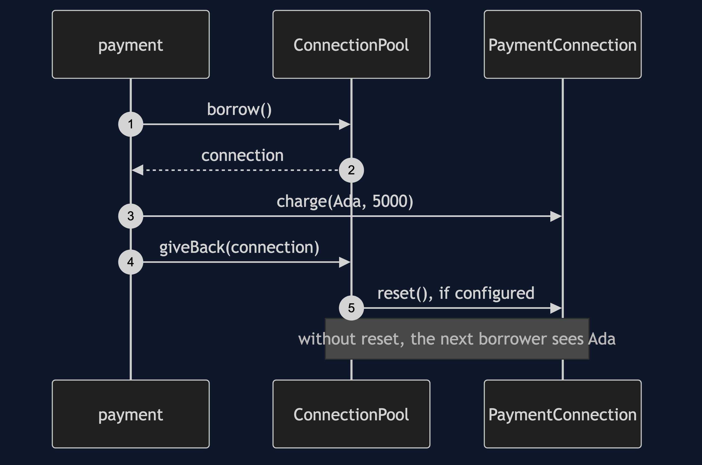
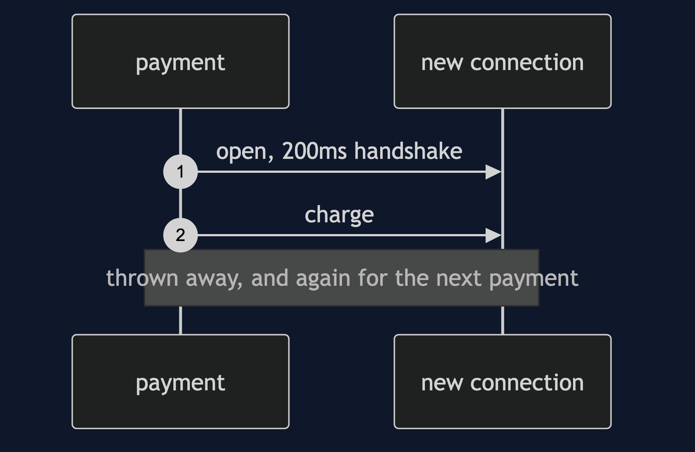
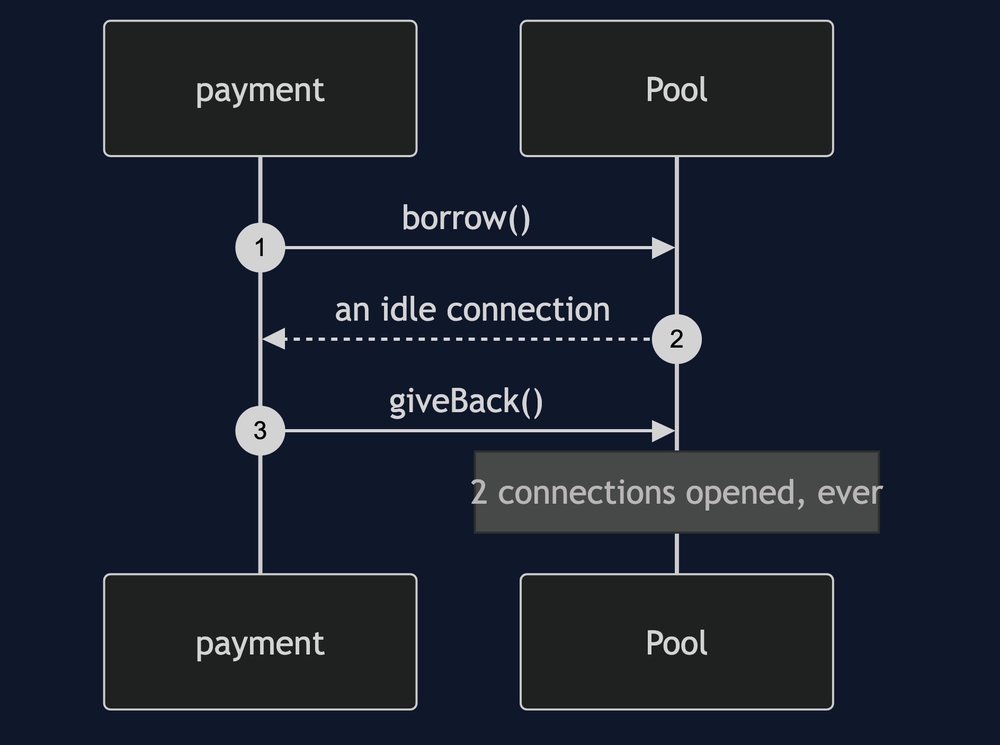
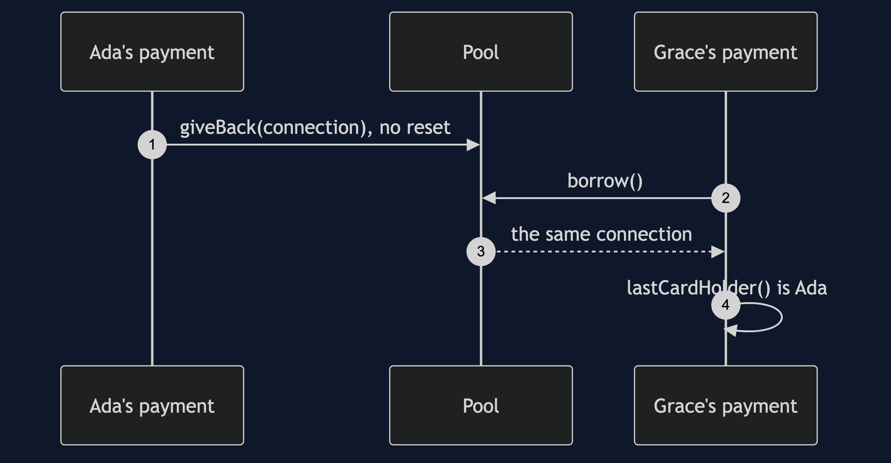
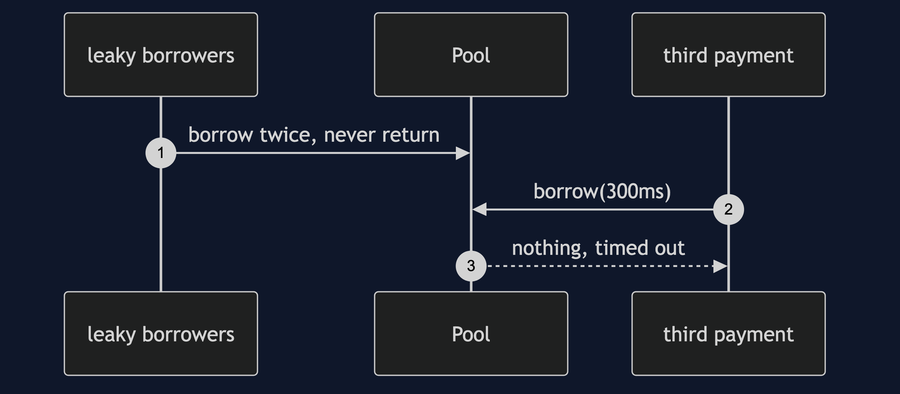

# Object Pool Pattern

```
src/main/java/com/jk/explore/objectpool/
├── PaymentDemo.java                 composition root — the six acts
│
├── domain/
│   └── PaymentConnection.java        expensive to make; remembers its last card holder
├── naive/
│   └── ConnectionPerPayment.java     a new connection for every payment
├── pattern/                         ← the real thing
│   └── ConnectionPool.java           borrowed and returned; optional reset on return
└── bench/                           ← the evidence
    ├── Receipt.java                  a three-field object: the kind people pool
    └── SmallObjectBenchmark.java     allocating against pooling it, method documented
```

**An object pool keeps a few expensive objects and lends them out, so the cost of creating one is paid once. Use it for what is expensive outside the JVM, and for nothing else.**

This is the second project in [foundational-design-patterns](..). It is one of the most over-applied ideas in Java, so the project's value is its honesty: the pattern is shown working, and then shown making things slower, leaking data between customers, hanging the application and being sized wrongly. It ends with a plain verdict.

## Run

```bash
./gradlew run
```

Six acts. The handshake is a stand-in for a real network handshake and takes 200 milliseconds. Timings are real and vary by machine; counts do not. The benchmark's method is under "How the benchmark was measured" below.

```
OBJECT POOL — expensive to make, cheap to borrow

ONE. A new connection for every payment.
  10 payments: 10 connections opened, 2075ms.
  every payment paid a 200ms handshake. simple, correct, and slow.

TWO. A pool of two connections, borrowed and returned.
  10 payments: 2 connections opened, 421ms, including opening the pool.
  this is the right use of the pattern: the thing pooled is expensive outside the JVM.

THREE. The bill: pooling a small object is slower than allocating it.
  a three-field object, 20000000 operations, median of 9 rounds after 5 warm-up rounds:
  allocating (the JIT may remove it entirely): 0.35 ns per operation
  allocating (forced onto the heap):           2.14 ns per operation
  borrowing from a pool:                       6.31 ns per operation
  the pool is 2.9 times slower than real allocation.
  objects created: 20000000 by allocating, 4 by pooling. the pool wins on that count and loses on time.
  why: the pool adds a lock and moves objects through shared memory, and the JVM's allocator is a pointer bump.
  timings vary by machine. the direction is the claim, and the method is in the README.

FOUR. The bill: a returned object carries its old state.
  Grace borrows the connection Ada just returned.
  the connection says its last card holder was: Ada Lovelace
  a security bug, not a performance one, and the one that happens in the field.
  with a reset on return: null. every pool needs one.

FIVE. The bill: a leaked object is never returned.
  two borrowers take both connections and never give them back.
  a third payment waited 310ms and got: nothing (rescued by a timeout)
  without the timeout it would wait forever. the application hangs. worse than a slow start.

SIX. The bill: sizing is a guess, and both directions cost.
  four payments at the same time, each needing 50ms of work on a connection:
  pool of 1:  220ms (they queue)
  pool of 4:  59ms
  pool of 50: 50 connections opened, and 46 sit idle, held open, for four payments.
  the verdict: pool what is expensive outside the JVM: connections, threads, native handles. nothing else.
  a thread pool is the same idea, and the pattern's other unambiguously correct use.
```

## Test

```bash
./gradlew test
```

2 test classes, 10 test methods, offline, none of which asserts a timing.

## Technologies and versions

| What | Version | Why it is here |
| --- | --- | --- |
| Java | 21 | The repository standard, via the Gradle toolchain block |
| Gradle | 9.2.1 | The wrapper in this directory; no separate install needed |
| JUnit 5 | 5.10.2 | Test runner |

No framework. A hand-built project stays plain Java so the mechanism is the whole lesson.

## Learning Material

| Document | What it covers |
| --- | --- |
| [`docs/problem-statement.md`](docs/problem-statement.md) | The handshake, and a connection per payment |
| [`docs/object-pool-pattern-explained.md`](docs/object-pool-pattern-explained.md) | The pattern, the evidence, the four costs, and the verdict |
| [`docs/class-diagram.md`](docs/class-diagram.md) | The types |
| [`docs/architecture-diagram.md`](docs/architecture-diagram.md) | Payments, the pool and the gateway |
| [`docs/data-flow-diagram.md`](docs/data-flow-diagram.md) | One borrow: a connection, a wait, or a timeout |
| [`docs/sequence-diagram.md`](docs/sequence-diagram.md) | Written for a listener with the screen off |
| [`docs/uml-diagram.md`](docs/uml-diagram.md) | Four sequences |
| [`docs/animation.html`](docs/animation.html) | The six acts in a browser |
| [`docs/prerequisites.md`](docs/prerequisites.md) | What you need to know |
| [`docs/session.md`](docs/session.md) | A one-hour taught session |
| [`docs/spec.md`](docs/spec.md) | The generated specification |
| [`docs/youtube.md`](docs/youtube.md) | Title, description and chapters |

### The pattern in one picture



### Where each piece sits


### How one request moves



### Who calls whom, in order



### All four sequences









### Video

Built from [`video/scenes.py`](video/scenes.py) by
[`video/build_video.sh`](video/build_video.sh). The rendered file is not
committed; see the repository README for why.

## How the benchmark was measured

Act three is a hand-rolled measurement, not JMH, so its method is written down. Full
detail is in [`docs/object-pool-pattern-explained.md`](docs/object-pool-pattern-explained.md).

- Each variant does the same work per operation, and adds to a sum that is read at
  the end, so the work cannot be optimised away.
- The pool is a synchronised `ArrayDeque`, used from one thread.
- Five warm-up rounds are discarded. Nine measured rounds follow, and the **median**
  is reported. The variants alternate in each round.
- Allocation is measured twice: as plain code, where the JIT may remove it entirely,
  and with every object stored in a static field so a real heap allocation must
  happen. **The pool is compared against the second.**
- Absolute numbers vary by machine. The direction, and a ratio of roughly three,
  were stable across repeated runs. No test asserts a timing.

## Where you have already met this

Every database `DataSource` you have configured is a connection pool, and every `ExecutorService` is a thread pool.

## When this is too much

For anything cheap to create, which is nearly everything.

## Where this sits

This is the second of five projects in [`foundational-design-patterns`](..). Its one unambiguously correct application beyond connections is the [Thread Pool](../../concurrency-design-patterns/thread-pool-pattern).
