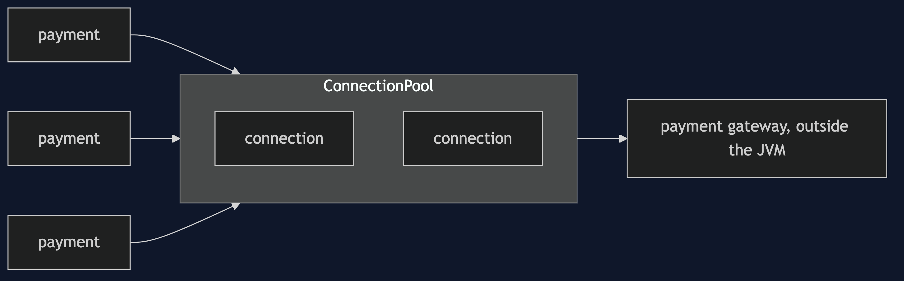
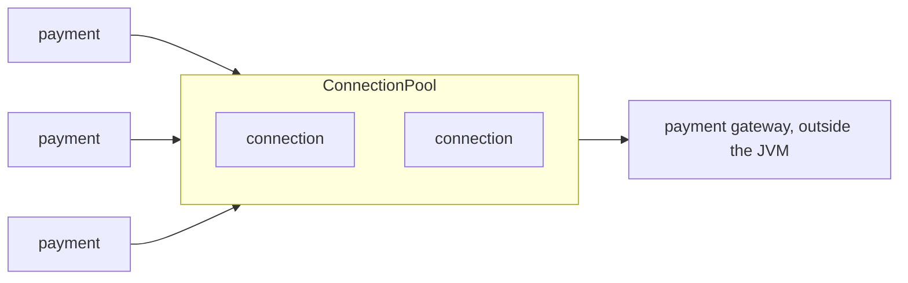

# Object Pool Pattern — Architecture Diagram

Callers borrow from the pool. The pool owns a few connections.

Mermaid source

```mermaid
flowchart LR
    P1["payment"] --> Pool
    P2["payment"] --> Pool
    P3["payment"] --> Pool
    subgraph Pool["ConnectionPool"]
        C1["connection"]
        C2["connection"]
    end
    Pool --> GW["payment gateway, outside the JVM"]
```

