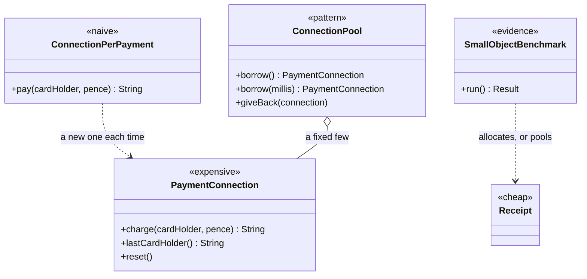

# Object Pool Pattern — Class Diagram

`ConnectionPool` wraps the expensive object. `SmallObjectBenchmark` is the evidence against pooling the cheap one.

Mermaid source

```mermaid
classDiagram
    class PaymentConnection {
        <<expensive>>
        +charge(cardHolder, pence) String
        +lastCardHolder() String
        +reset()
    }
    class ConnectionPerPayment {
        <<naive>>
        +pay(cardHolder, pence) String
    }
    class ConnectionPool {
        <<pattern>>
        +borrow() PaymentConnection
        +borrow(millis) PaymentConnection
        +giveBack(connection)
    }
    class Receipt {
        <<cheap>>
    }
    class SmallObjectBenchmark {
        <<evidence>>
        +run() Result
    }
    ConnectionPerPayment ..> PaymentConnection : a new one each time
    ConnectionPool o-- PaymentConnection : a fixed few
    SmallObjectBenchmark ..> Receipt : allocates, or pools
```

