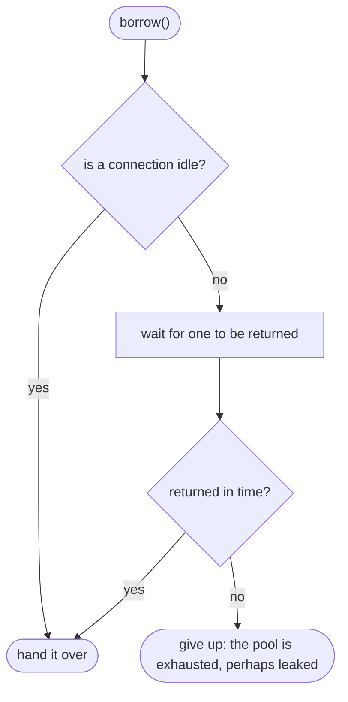

# Object Pool Pattern — Data Flow Diagram

One borrow: a connection, a wait, or a timeout.

Mermaid source

```mermaid
flowchart TD
    Ask(["borrow()"])
    Idle{"is a connection idle?"}
    Give(["hand it over"])
    Wait["wait for one to be returned"]
    Back{"returned in time?"}
    Timeout(["give up: the pool is exhausted, perhaps leaked"])
    Ask --> Idle
    Idle -- yes --> Give
    Idle -- no --> Wait --> Back
    Back -- yes --> Give
    Back -- no --> Timeout
```

