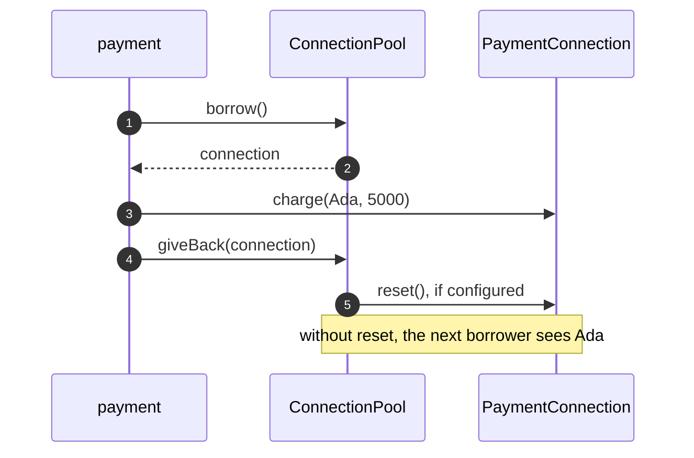

# Object Pool Pattern — Sequence Diagram

Written for a listener with the screen off.

Say it in words. A payment asks the pool for a connection. The pool takes one from its idle queue and hands it over. The payment charges the card, then gives the connection back. If the pool was built with a reset, it wipes the connection's memory of the last card holder before putting it back. If it was not, the next payment to borrow it can read the previous customer's name.

Mermaid source

The load-bearing sentence: **a pool is only safe if returning an object also cleans it.**
