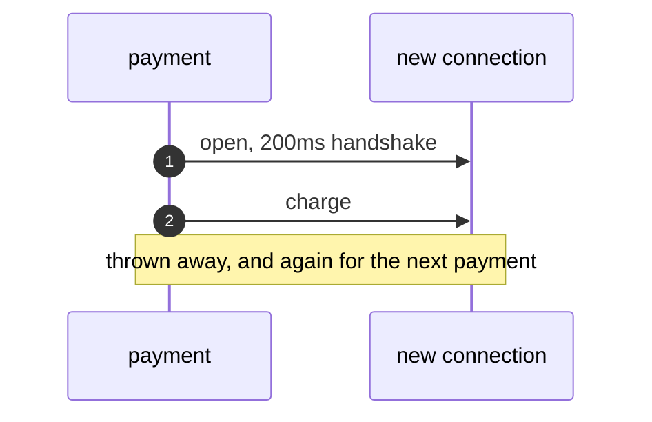
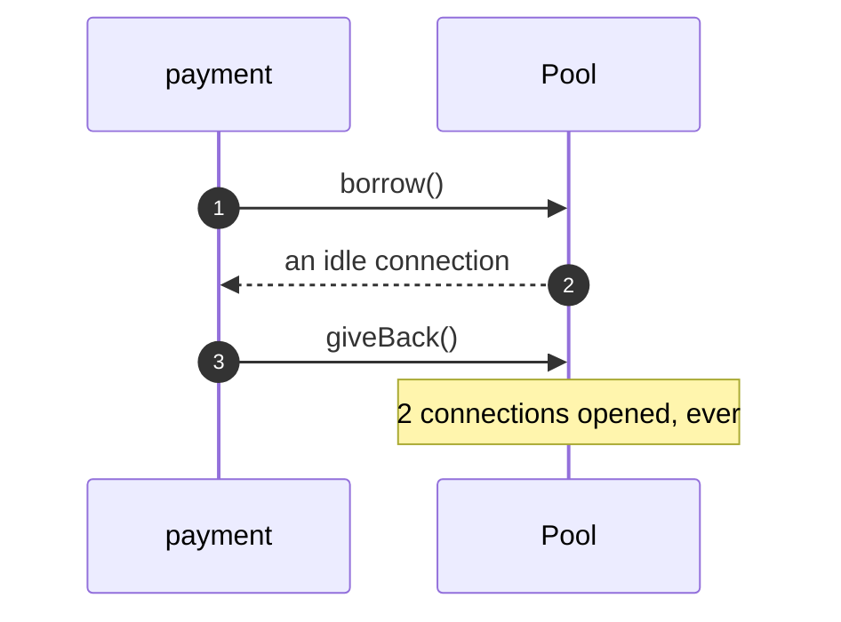
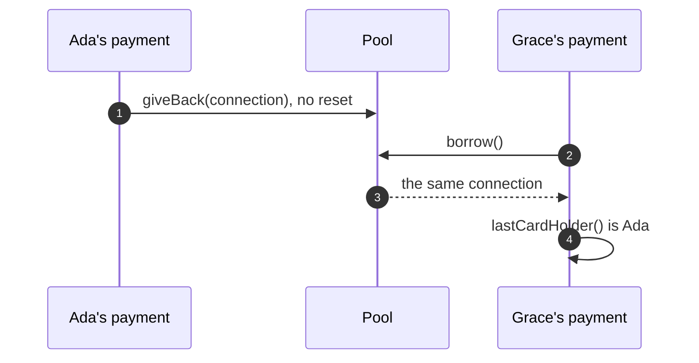
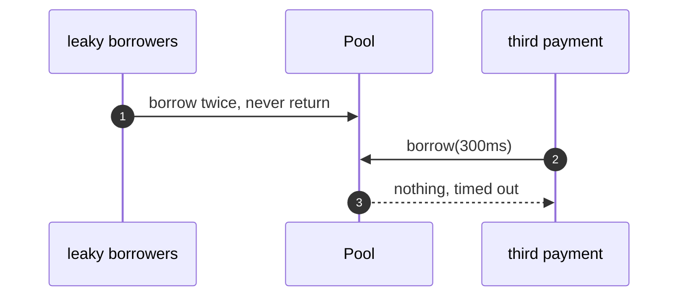

# Object Pool Pattern — UML Sequence Diagrams

Four sequences.

## 1. A Connection Per Payment

Mermaid source

## 2. Borrow And Return

Mermaid source

## 3. A Dirty Return

Mermaid source

## 4. An Exhausted Pool

Mermaid source

