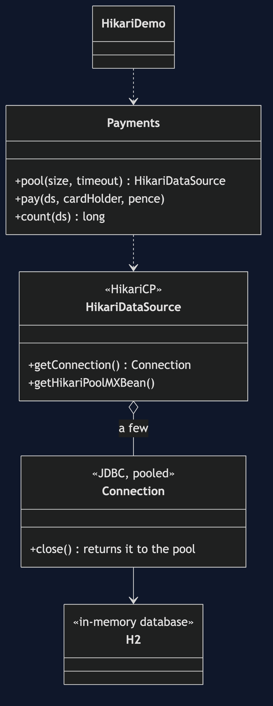
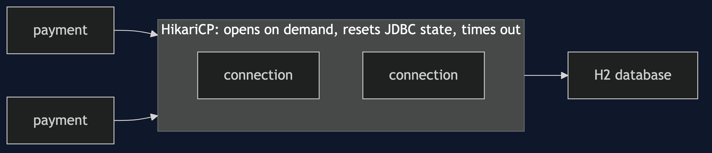
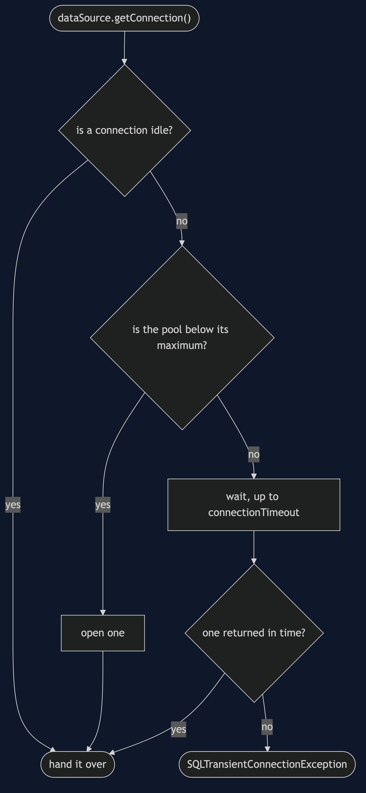
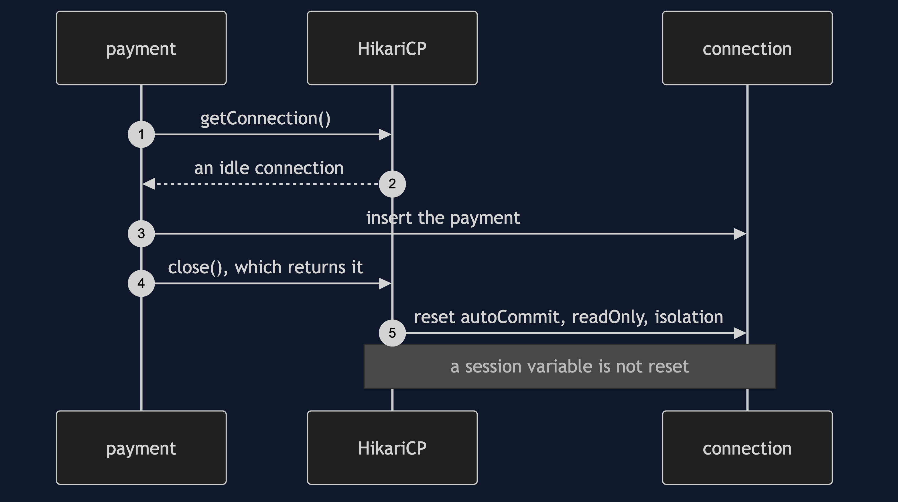
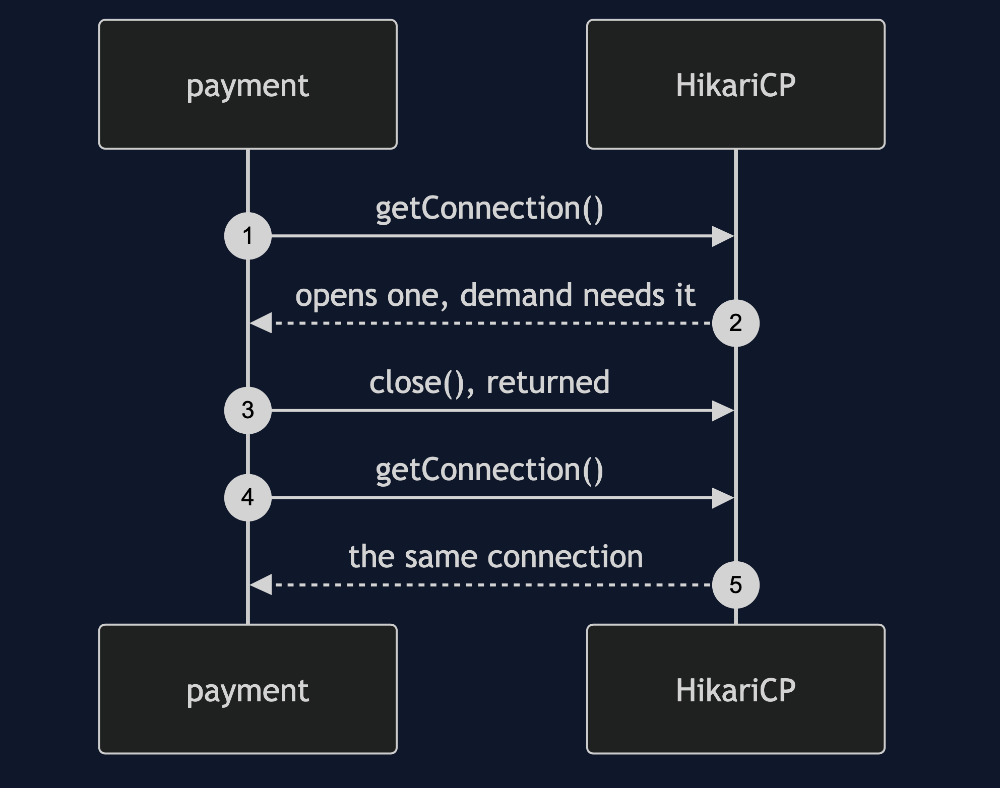
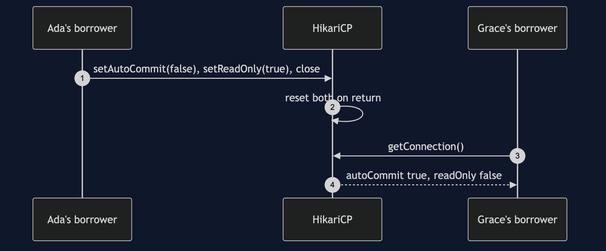
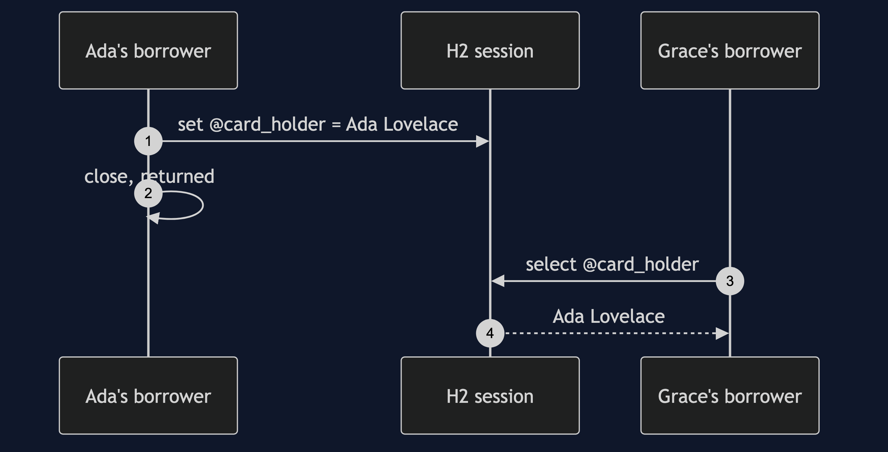
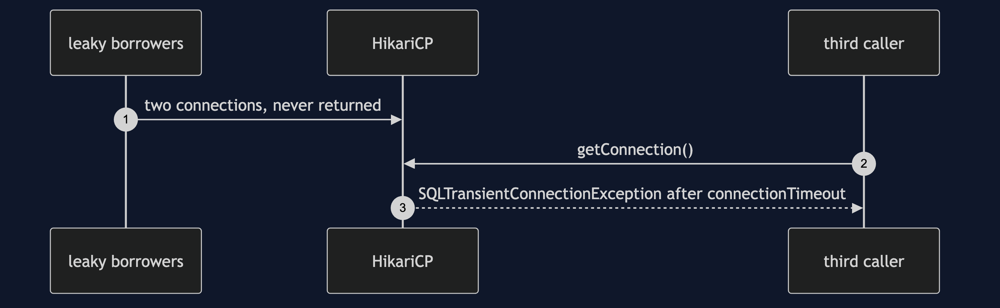

# Object Pool with HikariCP Pattern

```
src/main/java/com/jk/explore/hikaripool/
├── HikariDemo.java                  composition root — the six acts
└── Payments.java                    a payments table over in-memory H2, behind a real HikariCP pool
```

**HikariCP is a mature connection pool: it fixes the dirty-state and timeout problems a hand-built pool has to solve itself, and it cannot fix state it cannot see.**

This project is the framework version of [Object Pool](../object-pool-pattern). That project built a pool by hand and found four costs. HikariCP, the pool inside most Java applications, is the mature answer to several of them. It does not re-teach the pattern. It shows which costs a library solves, which remain, and why the verdict is still: pool what is expensive outside the JVM, and never write your own.

## Run

```bash
./gradlew run
```

Six acts. The partner project, Object Pool, built a pool by hand and found its costs. HikariCP is the mature answer to several of them, and this shows which, and which remain. Every count comes from HikariCP's own pool statistics.

```
OBJECT POOL WITH HIKARICP — the mature answer

ONE. The pool from the partner project, done by people who did it for years.
  10 payments, 10 rows written, through a pool that may hold at most 2.
  connections HikariCP actually opened: 1, active 0, idle 1. the payments ran one at a time, so one was enough: it opens what demand needs, up to the maximum.
  try-with-resources returns each connection: close() on a pooled connection gives it back.

TWO. The dirty return, which the partner project had to fix by hand.
  Ada's borrower sets autoCommit false and readOnly true, then returns the connection.
  Grace's borrower gets the same physical connection: autoCommit true, readOnly false.
  HikariCP reset the JDBC state it knows about on return. that is the reset the partner had to write.
  but state it does not know about stays: a session variable Ada set is read by Grace: Ada Lovelace
  the security bug is still possible. the pool cannot reset what it cannot see.

THREE. Exhaustion, with a timeout already built in.
  two borrowers take both connections and never return them.
  a third caller waited 316ms and got: SQLTransientConnectionException
  Connection is not available, request timed out after 305ms (total=2, active=2, idle=0, waiting=0)
  the timeout is a setting (connectionTimeout), not something you have to remember to write.
  its default is thirty seconds, so set it. leakDetectionThreshold can also log who never returned.

FOUR. Sizing is still a guess, and still costs in both directions.
  four payments at once, each needing 50ms on a connection, pool of 1: 219ms
  four payments at once, each needing 50ms on a connection, pool of 4: 55ms
  a pool of 50 opens 50 connections and keeps them idle, for four payments.
  HikariCP's own documentation argues for small pools. more is not faster.

FIVE. What pooling buys, on real JDBC.
  opening a new connection each time: about 40.3 microseconds.
  borrowing from the pool:            about 1.6 microseconds.
  this is an in-memory H2, whose connections are cheap. a real database over a network costs far more,
  which is exactly why the pattern is right here. timings vary by machine.

SIX. The verdict.
  pool connections, threads and native handles, and use a library that has already fixed the hard parts.
  never pool ordinary objects, and never write your own connection pool.
  where you have met this: every DataSource. Spring Boot's default is HikariCP.
```

## Test

```bash
./gradlew test
```

2 test classes, 7 test methods, offline, over in-memory H2, none of which asserts a timing.

## Technologies and versions

| What | Version | Why it is here |
| --- | --- | --- |
| Java | 21 | The repository standard, via the Gradle toolchain block |
| Gradle | 9.2.1 | The wrapper in this directory; no separate install needed |
| HikariCP | from Spring Boot 4.1.1's bill of materials | The connection pool being shown |
| H2 | from Spring Boot 4.1.1's bill of materials | An in-memory database, so nothing is installed |
| slf4j-nop | from Spring Boot 4.1.1's bill of materials | Silences HikariCP's logging, so the demo output stays readable |
| JUnit 5 | 5.10.2 | Test runner |

Spring Boot itself is not a dependency; its bill of materials is used only for versions. See [`docs/dependencies.md`](docs/dependencies.md).

## Learning Material

| Document | What it covers |
| --- | --- |
| [`docs/problem-statement.md`](docs/problem-statement.md) | The partner's pool, and what a mature one solves |
| [`docs/object-pool-with-hikaricp-pattern-explained.md`](docs/object-pool-with-hikaricp-pattern-explained.md) | What HikariCP fixes, what it cannot, and the verdict |
| [`docs/class-diagram.md`](docs/class-diagram.md) | The types |
| [`docs/architecture-diagram.md`](docs/architecture-diagram.md) | Payments, HikariCP and the database |
| [`docs/data-flow-diagram.md`](docs/data-flow-diagram.md) | One borrow: a connection, a wait, or a timeout |
| [`docs/sequence-diagram.md`](docs/sequence-diagram.md) | Written for a listener with the screen off |
| [`docs/uml-diagram.md`](docs/uml-diagram.md) | Four sequences |
| [`docs/animation.html`](docs/animation.html) | The six acts in a browser |
| [`docs/prerequisites.md`](docs/prerequisites.md) | What you need to know |
| [`docs/session.md`](docs/session.md) | A one-hour taught session |
| [`docs/spec.md`](docs/spec.md) | The generated specification |
| [`docs/youtube.md`](docs/youtube.md) | Title, description and chapters |
| [`docs/dependencies.md`](docs/dependencies.md) | What HikariCP and H2 are, what they cost, and that skipping this project loses none of the pattern |

### The pattern in one picture



### Where each piece sits



### How one request moves



### Who calls whom, in order



### All four sequences









### Video

Built from [`video/scenes.py`](video/scenes.py) by
[`video/build_video.sh`](video/build_video.sh). The rendered file is not
committed; see the repository README for why.

## Where you have already met this

Every Spring Boot application with a database uses HikariCP, and every `DataSource` is a pool.

## When this is too much

For anything cheap to create, which is nearly everything else.

## Where this sits

This project pairs with [Object Pool](../object-pool-pattern), and is a framework version in [`foundational-design-patterns`](..).
