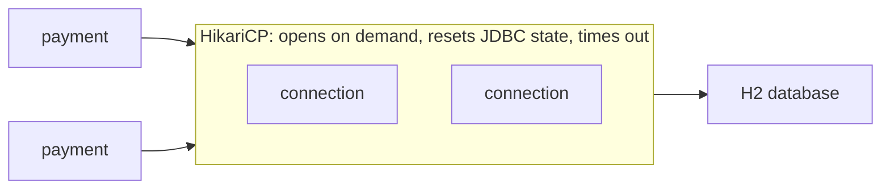

# Object Pool with HikariCP Pattern — Architecture Diagram

Payments borrow from HikariCP, which keeps a few real connections to the database.

Mermaid source

```mermaid
flowchart LR
    P1["payment"] --> Pool
    P2["payment"] --> Pool
    subgraph Pool["HikariCP: opens on demand, resets JDBC state, times out"]
        C1["connection"]
        C2["connection"]
    end
    Pool --> DB["H2 database"]
```

