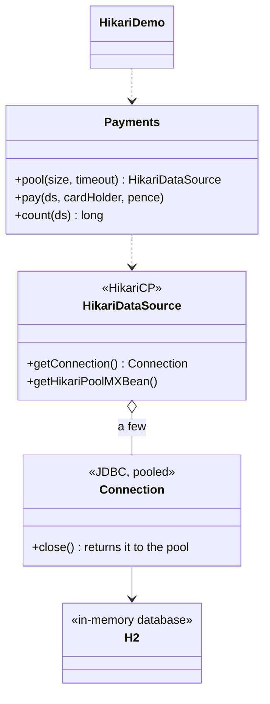

# Object Pool with HikariCP Pattern — Class Diagram

A `HikariDataSource` in front of H2. The application sees only a `DataSource`.

Mermaid source

```mermaid
classDiagram
    class Payments {
        +pool(size, timeout) HikariDataSource
        +pay(ds, cardHolder, pence)
        +count(ds) long
    }
    class HikariDataSource {
        <<HikariCP>>
        +getConnection() Connection
        +getHikariPoolMXBean()
    }
    class Connection {
        <<JDBC, pooled>>
        +close() returns it to the pool
    }
    class H2 {
        <<in-memory database>>
    }
    class HikariDemo
    Payments ..> HikariDataSource
    HikariDataSource o-- Connection : a few
    Connection --> H2
    HikariDemo ..> Payments
```

