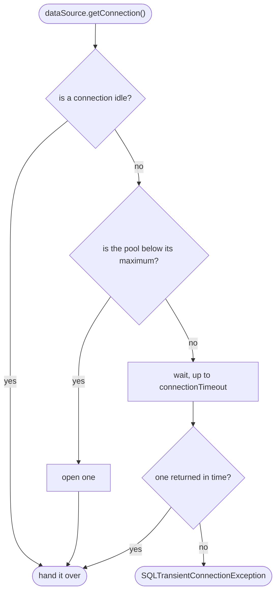

# Object Pool with HikariCP Pattern — Data Flow Diagram

One borrow: a connection, a wait, or a timeout that is already configured.

Mermaid source

```mermaid
flowchart TD
    Ask(["dataSource.getConnection()"])
    Idle{"is a connection idle?"}
    Room{"is the pool below its maximum?"}
    Give(["hand it over"])
    Open["open one"]
    Wait["wait, up to connectionTimeout"]
    Back{"one returned in time?"}
    Fail(["SQLTransientConnectionException"])
    Ask --> Idle
    Idle -- yes --> Give
    Idle -- no --> Room
    Room -- yes --> Open --> Give
    Room -- no --> Wait --> Back
    Back -- yes --> Give
    Back -- no --> Fail
```

