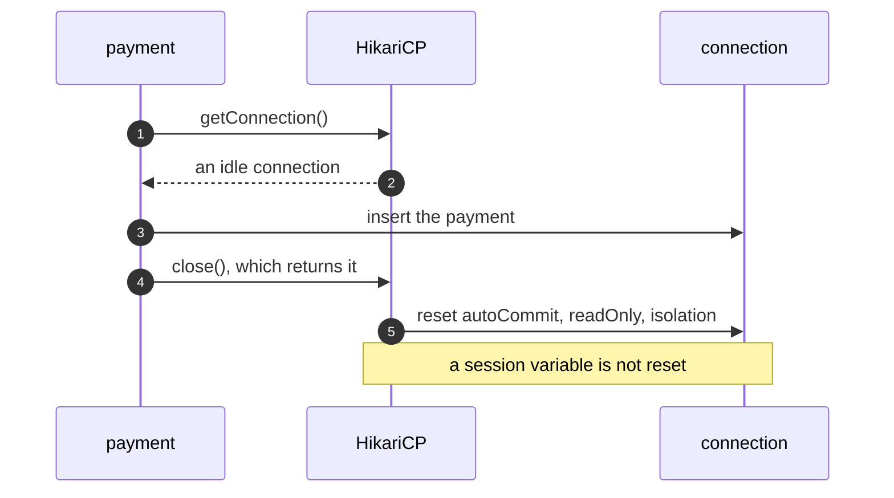

# Object Pool with HikariCP Pattern — Sequence Diagram

Written for a listener with the screen off.

Say it in words. A payment asks the pool for a connection. The pool hands over an idle one, or opens one if it is below its maximum. The payment writes its row, and closes the connection, which does not close it: the pool takes it back and resets the JDBC settings it knows about. The next payment gets the same connection, with autocommit and read-only back at their defaults. But anything set inside the database session, which the pool cannot see, is still there.

Mermaid source

The load-bearing sentence: **the pool cannot reset what it cannot see.**
