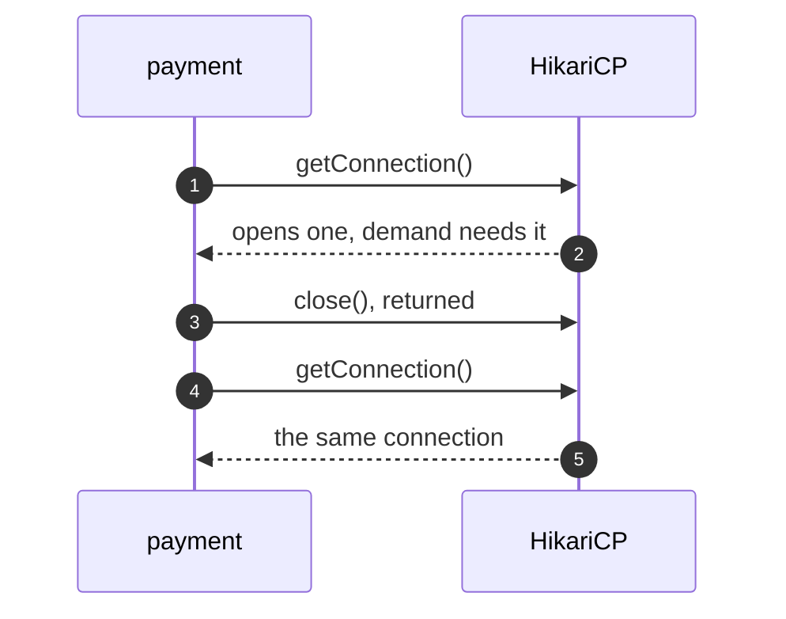
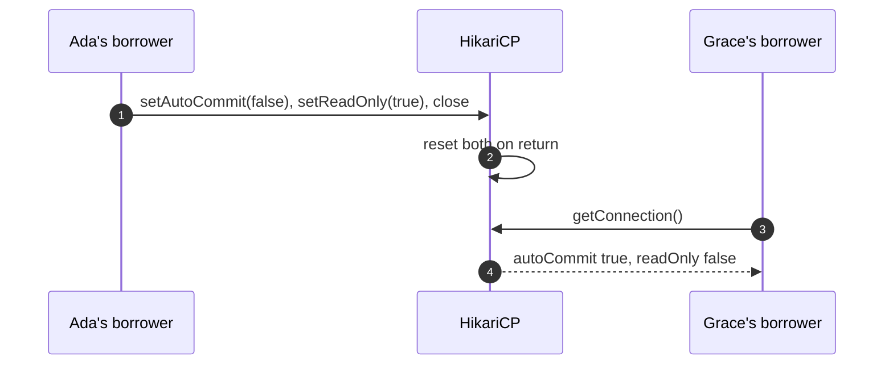
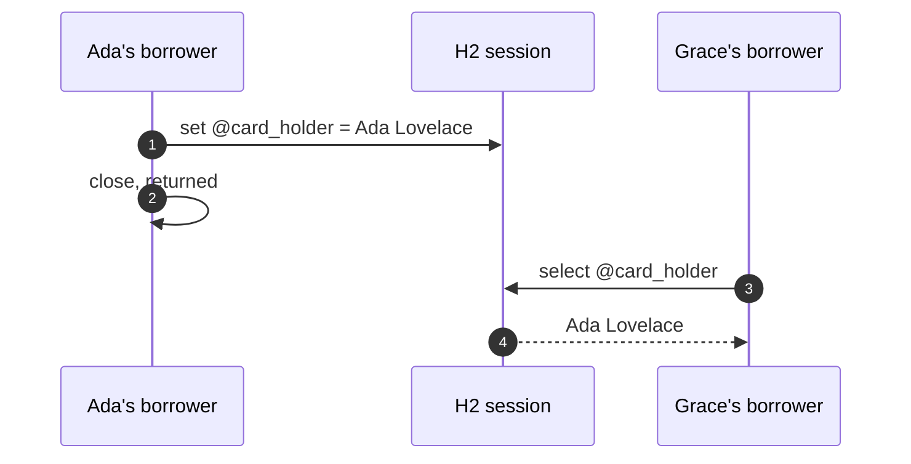
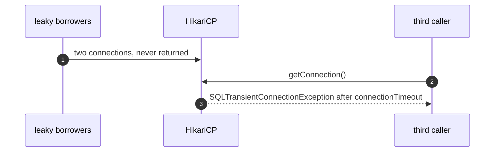

# Object Pool with HikariCP Pattern — UML Sequence Diagrams

Four sequences.

## 1. Borrow And Return

Mermaid source

## 2. A Reset On Return

Mermaid source

## 3. A Leak Through The Session

Mermaid source

## 4. An Exhausted Pool

Mermaid source

