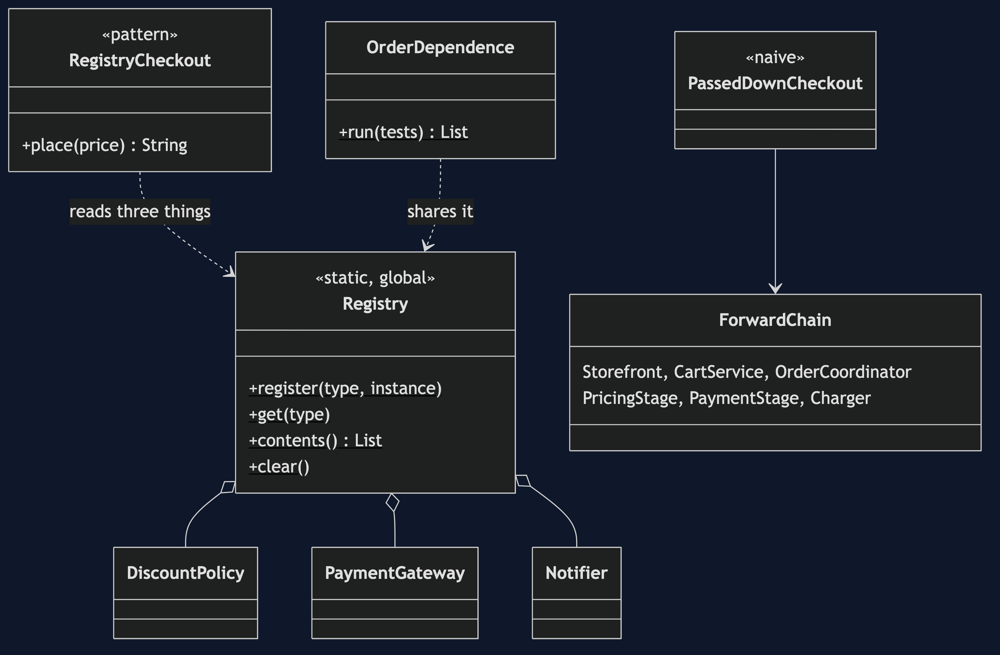
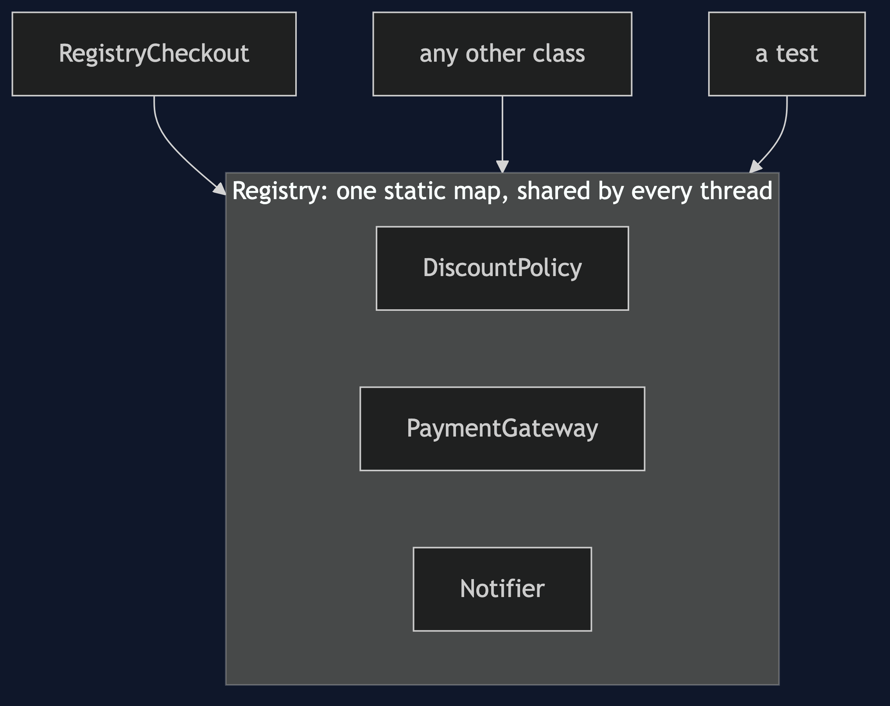
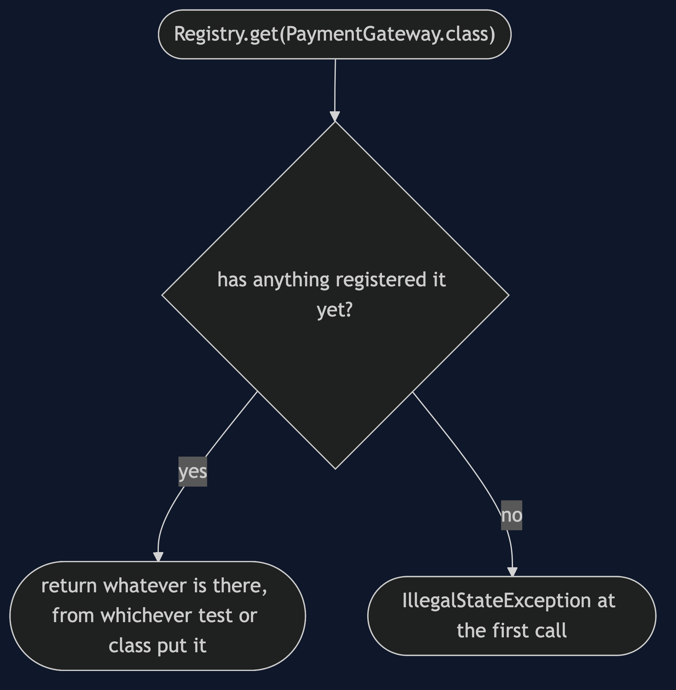
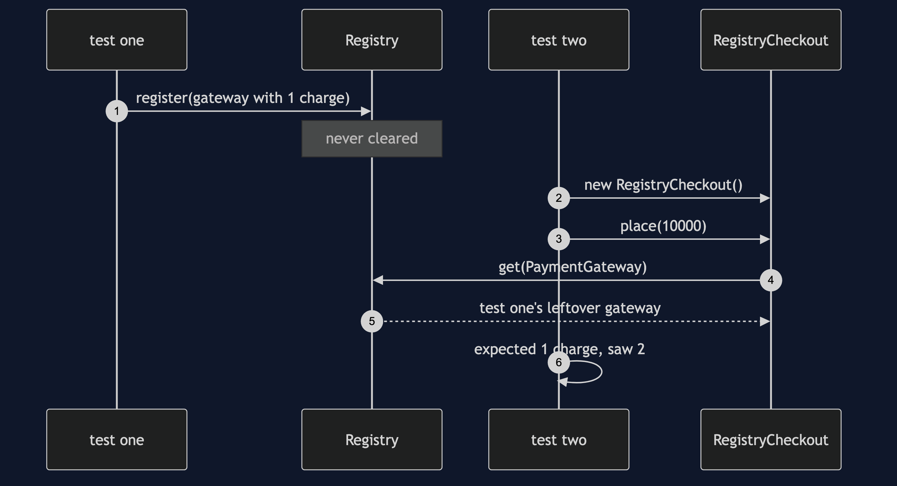

# Registry Pattern

```
src/main/java/com/jk/explore/registry/
├── CheckoutDemo.java                composition root — the six acts
│
├── domain/                          ← the three collaborators, shared by the next two projects
│   ├── DiscountPolicy.java  LoyaltyPolicy.java
│   ├── PaymentGateway.java  RecordingGateway.java
│   ├── Notifier.java  RecordingNotifier.java
│   └── ForwardChain.java             six classes; the gateway is handed through all of them
├── naive/
│   └── PassedDownCheckout.java       everything passed down through constructors
│
└── pattern/                         ← the real thing
    ├── Registry.java                 Registry.get(PaymentGateway.class)
    ├── RegistryCheckout.java         its constructor takes nothing
    └── OrderDependence.java          two tests that share a registry
```

**A registry is a well-known object that other objects find things in: `Registry.get(PaymentGateway.class)`. It is a global variable with better manners.**

This is the third project in [foundational-design-patterns](..), and the first of three that answer one question: how does an object get hold of what it needs? Registry is a well-known place to put things. [Service Locator](../service-locator-pattern) is a middleman you ask. [Dependency Injection](../dependency-injection-pattern) is what happens when you stop asking. All three use the same three collaborators, so they can be compared directly.

## Run

```bash
./gradlew run
```

Six acts. The same three collaborators (a discount policy, a payment gateway and a notifier) are used by Registry, Service Locator and Dependency Injection, so all three can be compared directly.

```
REGISTRY — the well-known place everything is kept

ONE. Pass it down — through six constructors.
  receipt-1, charged [9000]
  the gateway went through Storefront, CartService, OrderCoordinator, PricingStage,
  PaymentStage and Charger. only the last one uses it. the other five forward it.
  that is real friction, and every dependency is honestly visible in a signature.

TWO. The pattern — a well-known place to ask.
  receipt-1, charged [9000]
  RegistryCheckout's constructor takes nothing. six constructors became none.

THREE. The bill: the dependencies are invisible.
  new RegistryCheckout() compiled and ran. its signature says it needs nothing.
  the first call failed: nothing is registered for DiscountPolicy
  three things had to be registered first, and nothing in the class says so.

FOUR. The bill: a test fails because of the order the tests ran in.
  order one: [checkoutChargesTheRealGateway: passed, refundTestLeavesItsGatewayBehind: passed]
  order two: [refundTestLeavesItsGatewayBehind: passed, checkoutChargesTheRealGateway: FAILED (expected exactly one charge in total, saw 2)]
  neither test changed. the order did. that is the symptom teams meet first.

FIVE. The bill: what is in it, right now?
  at start-up:            []
  after one class ran:    [DiscountPolicy]
  after two more:         [DiscountPolicy, Notifier, PaymentGateway]
  that answer is not in any one file. it depends on what ran, and in what order.
  it is also a static map shared by every thread, so thread safety is now a question.

SIX. The verdict.
  use a registry narrowly: for a very few things that are truly application-wide,
  set up once at start-up and never changed. not for collaborators that vary or need testing.
  the fix for what it hides is a middleman that can find and create things: a service locator.
  where you have met this: System.getProperties(), a static Logger factory, Locale.getDefault().
```

## Test

```bash
./gradlew test
```

2 test classes, 8 test methods, offline, with nothing installed and no framework.

## Technologies and versions

| What | Version | Why it is here |
| --- | --- | --- |
| Java | 21 | The repository standard, via the Gradle toolchain block |
| Gradle | 9.2.1 | The wrapper in this directory; no separate install needed |
| JUnit 5 | 5.10.2 | Test runner |

No framework. A hand-built project stays plain Java so the mechanism is the whole lesson.

## Learning Material

| Document | What it covers |
| --- | --- |
| [`docs/problem-statement.md`](docs/problem-statement.md) | The gateway, passed through six constructors |
| [`docs/registry-pattern-explained.md`](docs/registry-pattern-explained.md) | The registry, four costs with evidence, and the verdict |
| [`docs/class-diagram.md`](docs/class-diagram.md) | The types |
| [`docs/architecture-diagram.md`](docs/architecture-diagram.md) | Everything reaches the registry |
| [`docs/data-flow-diagram.md`](docs/data-flow-diagram.md) | One get: a thing, or a surprise |
| [`docs/sequence-diagram.md`](docs/sequence-diagram.md) | Written for a listener with the screen off |
| [`docs/uml-diagram.md`](docs/uml-diagram.md) | Four sequences |
| [`docs/animation.html`](docs/animation.html) | The six acts in a browser |
| [`docs/prerequisites.md`](docs/prerequisites.md) | What you need to know |
| [`docs/session.md`](docs/session.md) | A one-hour taught session |
| [`docs/spec.md`](docs/spec.md) | The generated specification |
| [`docs/youtube.md`](docs/youtube.md) | Title, description and chapters |

### The pattern in one picture



### Where each piece sits



### How one request moves



### Who calls whom, in order



### All four sequences


### Video

Built from [`video/scenes.py`](video/scenes.py) by
[`video/build_video.sh`](video/build_video.sh). The rendered file is not
committed; see the repository README for why.

## Where you have already met this

Every static `getInstance()`, `Context.get()` or `Locale.getDefault()` is a relative of this.

## When this is too much

For nearly everything that is not truly application-wide.

## Where this sits

This is the third of five projects in [`foundational-design-patterns`](..). It leads to [Service Locator](../service-locator-pattern) and then [Dependency Injection](../dependency-injection-pattern).

## Also available with a framework

[Registry with Spring Pattern](../registry-with-spring-pattern) reruns this idea on a real framework, and shows what the framework adds and where it can undo the pattern. Watch this project first.
