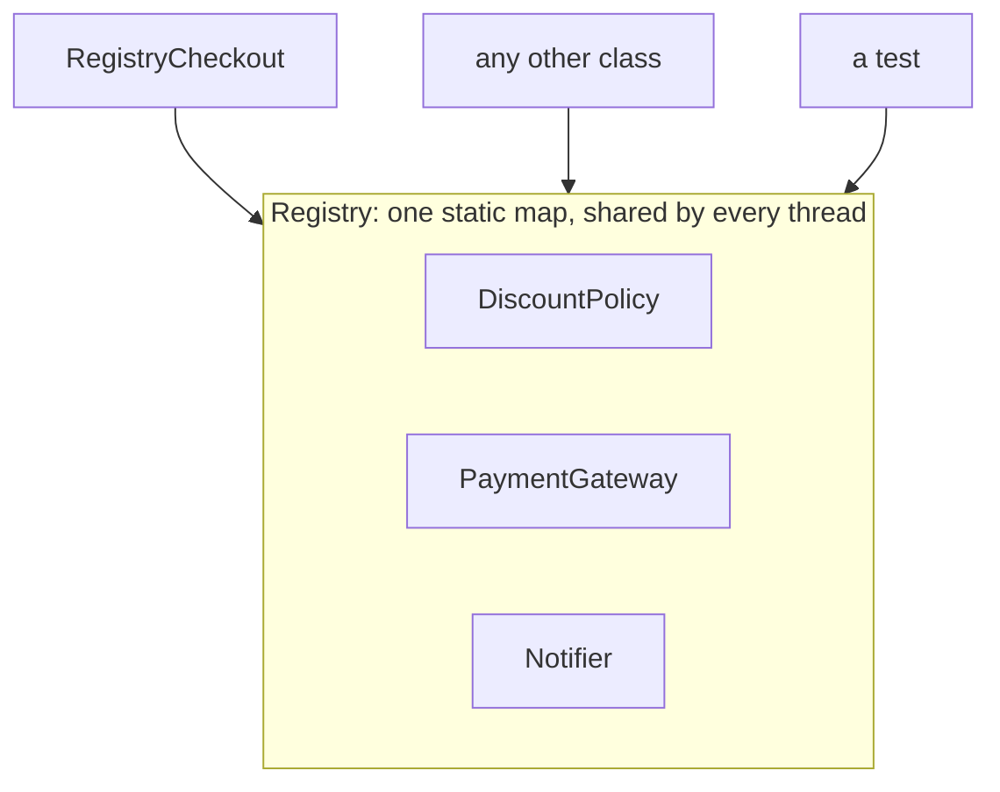

# Registry Pattern — Architecture Diagram

Everything reaches the registry, and the registry reaches everything.

Mermaid source

```mermaid
flowchart TB
    A["RegistryCheckout"] --> R
    B["any other class"] --> R
    T["a test"] --> R
    subgraph R["Registry: one static map, shared by every thread"]
        P["DiscountPolicy"]
        G["PaymentGateway"]
        N["Notifier"]
    end
```

