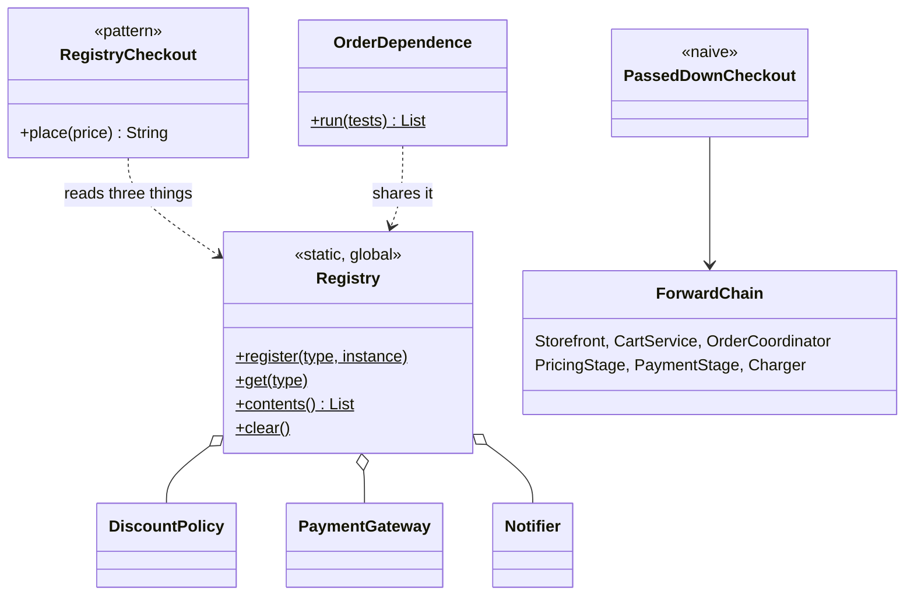

# Registry Pattern — Class Diagram

`RegistryCheckout` depends on `Registry`, and on nothing you can see.

Mermaid source

```mermaid
classDiagram
    class Registry {
        <<static, global>>
        +register(type, instance)$
        +get(type)$
        +contents()$ List
        +clear()$
    }
    class RegistryCheckout {
        <<pattern>>
        +place(price) String
    }
    class PassedDownCheckout {
        <<naive>>
    }
    class ForwardChain {
        Storefront, CartService, OrderCoordinator
        PricingStage, PaymentStage, Charger
    }
    class DiscountPolicy
    class PaymentGateway
    class Notifier
    class OrderDependence {
        +run(tests)$ List
    }
    RegistryCheckout ..> Registry : reads three things
    Registry o-- DiscountPolicy
    Registry o-- PaymentGateway
    Registry o-- Notifier
    PassedDownCheckout --> ForwardChain
    OrderDependence ..> Registry : shares it
```

