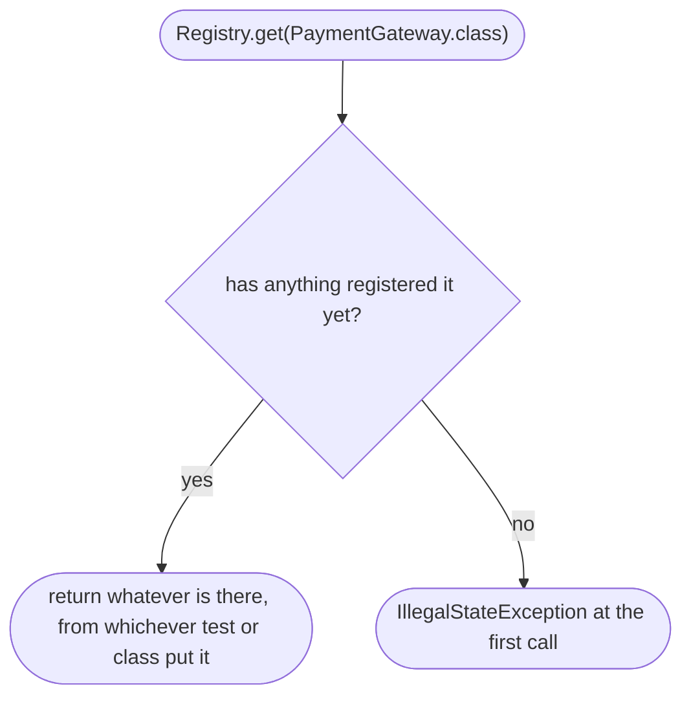

# Registry Pattern — Data Flow Diagram

One `get`: a thing, or a failure that nothing in the signature warned about.

Mermaid source

```mermaid
flowchart TD
    Ask(["Registry.get(PaymentGateway.class)"])
    Has{"has anything registered it yet?"}
    Ret(["return whatever is there, from whichever test or class put it"])
    Fail(["IllegalStateException at the first call"])
    Ask --> Has
    Has -- yes --> Ret
    Has -- no --> Fail
```

