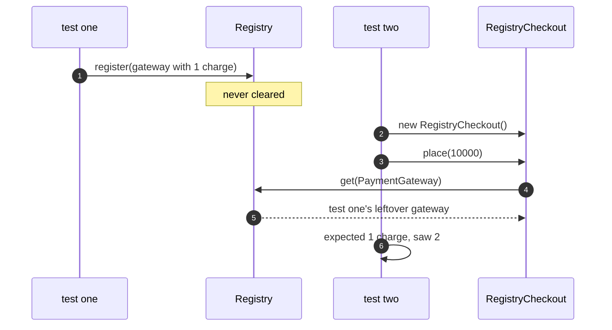

# Registry Pattern — Sequence Diagram

Written for a listener with the screen off.

Say it in words. A test registers a gateway that has already taken one charge, and finishes, without clearing the registry. A second test then builds a checkout, which takes nothing in its constructor, and places an order. The checkout asks the registry for the gateway and gets the first test's leftover one. It charges it. The second test checks that exactly one charge was made in total, and finds two. It fails, though nothing in it changed.

Mermaid source

The load-bearing sentence: **neither test changed, and one failed, because the order changed.**
