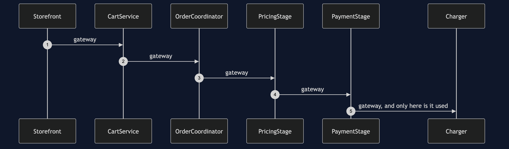
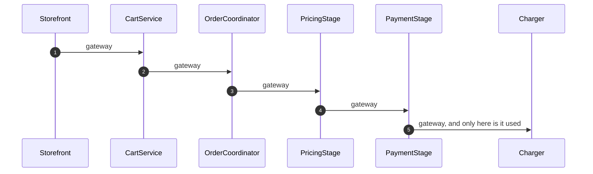
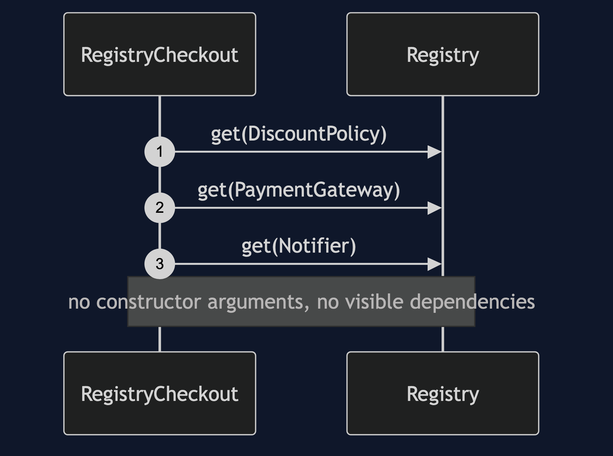
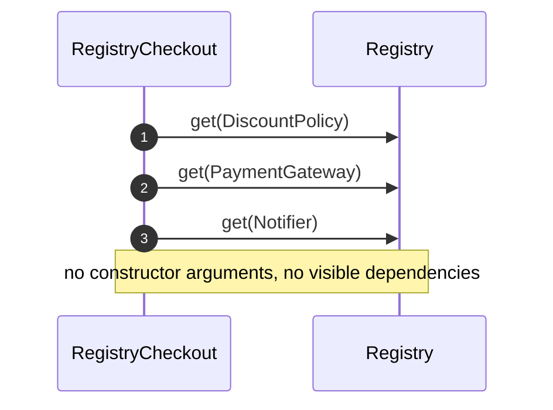
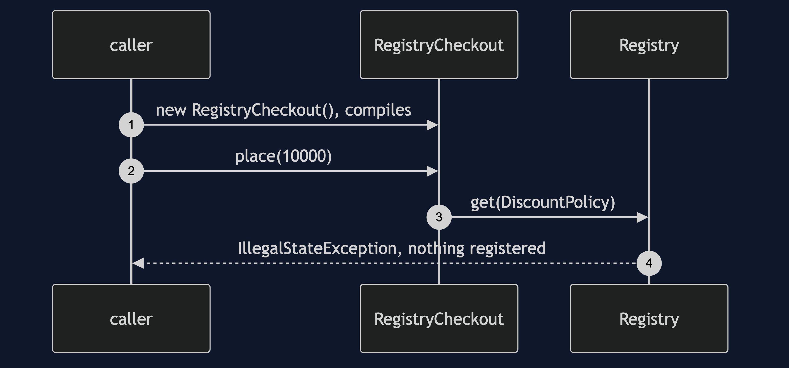
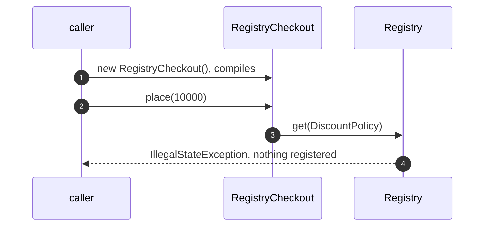
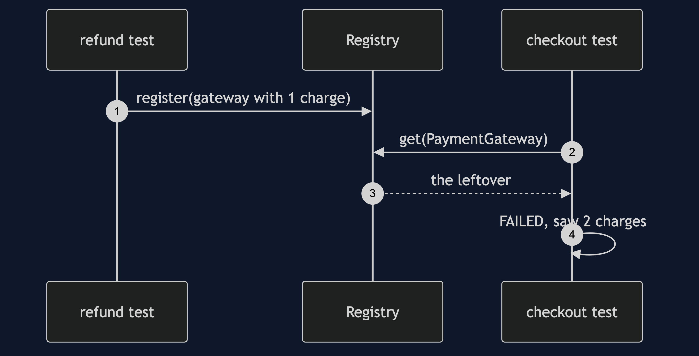
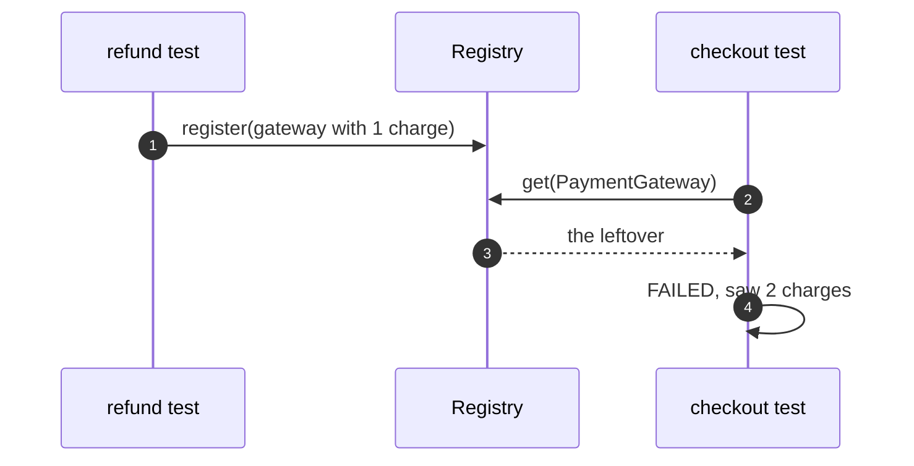

# Registry Pattern — UML Sequence Diagrams

Four sequences.

## 1. Passed Down

Mermaid source

## 2. Asked Of The Registry

Mermaid source

## 3. An Unregistered Dependency

Mermaid source

## 4. Order Dependence

Mermaid source

