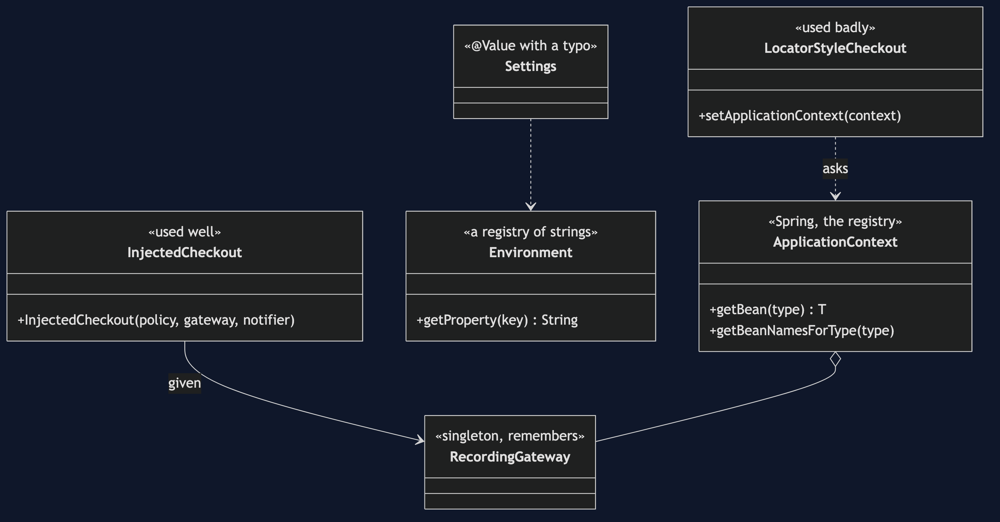
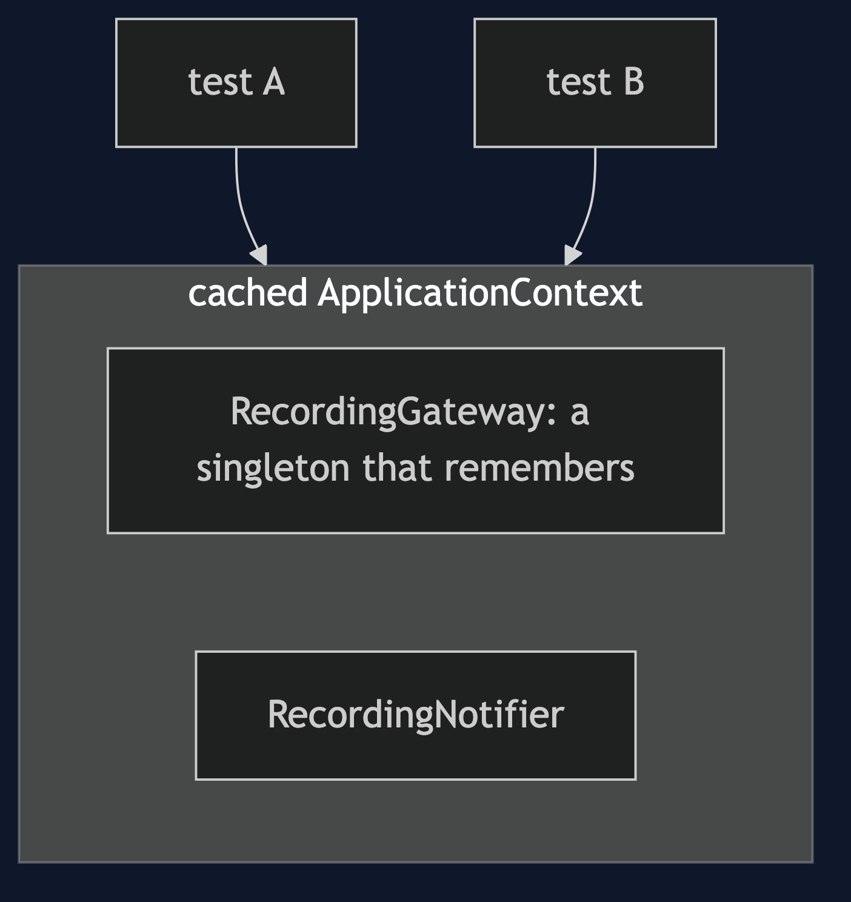
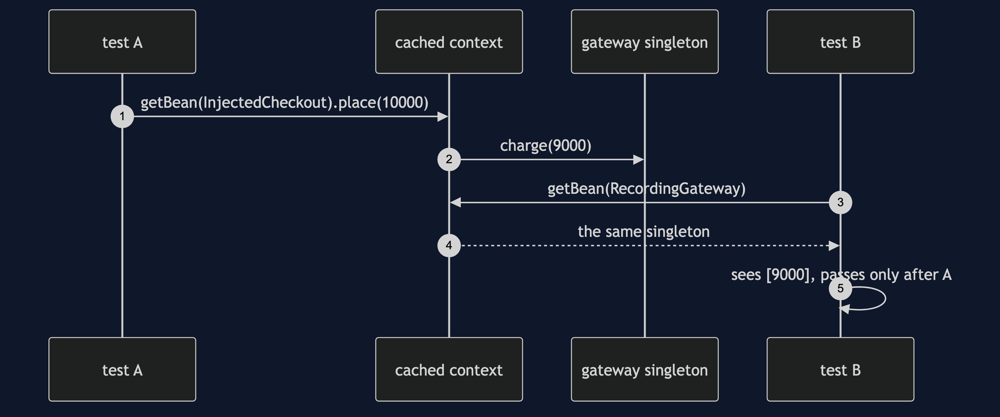

# Registry with Spring Pattern

```
src/main/java/com/jk/explore/registryspring/
├── RegistrySpringApplication.java   the Spring Boot entry point and the six acts
│
├── domain/                          ← the partner's collaborators, with @Component added
│   ├── DiscountPolicy.java  LoyaltyPolicy.java
│   ├── PaymentGateway.java  RecordingGateway.java
│   └── Notifier.java  RecordingNotifier.java  SmsNotifier.java   a second Notifier
└── app/
    ├── InjectedCheckout.java         the registry used well: never called
    ├── LocatorStyleCheckout.java     the registry used badly: getBean, three times
    └── Settings.java                 @Value with a typo
```

**Spring's ApplicationContext is a registry: `getBean(PaymentGateway.class)`. It fixes most of what the hand-built registry got wrong, and it still leaks shared state between tests.**

This project is the framework version of [Registry](../registry-pattern). That project built a static registry by hand and listed its costs. Spring's `ApplicationContext` is a registry too, built far better: declared with `@Component`, checked when it starts, and mostly never called. It does not re-teach the pattern. It shows what Spring fixes, and the failure that is Spring's own: a cached context whose singletons remember what earlier tests did.

## Run

```bash
./gradlew run
```

Six acts. The partner project, Registry, built a static registry by hand and listed its costs. Spring's ApplicationContext is a registry too, built far better, and this project shows what it fixes and what it leaves.

```
REGISTRY WITH SPRING — the context is a registry you did not write

ONE. The ApplicationContext is the registry.
  Registry.get(PaymentGateway.class) in the partner project is context.getBean(PaymentGateway.class) here: RecordingGateway
  registered by declaration: @Component on a class. beans of type PaymentGateway: [recordingGateway]
  no static map, no register() calls scattered through the code, and a missing bean fails at start-up.

TWO. Used well, nobody calls it. Used badly, it is the hand-built registry again.
  InjectedCheckout is given its collaborators: receipt-1
  LocatorStyleCheckout calls context.getBean three times: receipt-2
  same result. but LocatorStyleCheckout's constructor takes nothing, and its dependencies are invisible again.
  new LocatorStyleCheckout() compiled, and threw NullPointerException: it needs Spring to hand it the context.

THREE. The failure of its own: shared state, through the context cache.
  Spring's test support caches a context and reuses it across tests with the same configuration.
  test A ran on the shared context and charged once. the gateway is a singleton, so it remembers: [9000]
  test B, on the same cached context, starts by expecting a clean gateway. it sees: [9000]
  that is the hand-built registry's order-dependent test failure, in Spring. the tests in this project prove it.
  a fresh context (what @DirtiesContext gives) sees: [], at the price of starting Spring again.

FOUR. The Environment is a registry of strings.
  checkout.currency = GBP
  checkout.curency (a typo) = null, where the right answer was GBP. no error, no warning.
  a required @Value with the same typo fails when the context starts:
  Could not resolve placeholder 'checkout.curency' in value "${checkout.curency}"
  the untyped lookup is silent; the injected one is not.

FIVE. Asking by type is ambiguous the moment there are two.
  context.getBean(Notifier.class) with two Notifiers: NoUniqueBeanDefinitionException
  found: [recordingNotifier, smsNotifier]. a run-time error at the call site, not a compile error.

SIX. The verdict.
  Spring's context is the registry done well: declared, checked at start-up, and mostly never called.
  keep calling getBean to main, to tests and to framework glue. in business code, inject instead.
  a getBean inside a business class is a Service Locator, with all its costs.
  and keep singleton state out of anything a test shares.
```

## Test

```bash
./gradlew test
```

4 test classes, 11 test methods, offline, each Spring context started inside the test, with no server.

## Technologies and versions

| What | Version | Why it is here |
| --- | --- | --- |
| Java | 21 | The repository standard, via the Gradle toolchain block |
| Gradle | 9.2.1 | The wrapper in this directory; no separate install needed |
| Spring Boot | 4.1.1 | The container, whose ApplicationContext is the registry |
| Spring Framework | from Spring Boot 4.1.1 | `ApplicationContext`, `Environment`, and the test context cache |
| JUnit 5 | 5.10.2 | Test runner |

No web starter and no database. See [`docs/dependencies.md`](docs/dependencies.md).

## Learning Material

| Document | What it covers |
| --- | --- |
| [`docs/problem-statement.md`](docs/problem-statement.md) | The partner's checkout, and what is new |
| [`docs/registry-with-spring-pattern-explained.md`](docs/registry-with-spring-pattern-explained.md) | What Spring fixes, and the failures that are its own |
| [`docs/class-diagram.md`](docs/class-diagram.md) | The types |
| [`docs/architecture-diagram.md`](docs/architecture-diagram.md) | One cached context, shared |
| [`docs/data-flow-diagram.md`](docs/data-flow-diagram.md) | A test's view of a singleton |
| [`docs/sequence-diagram.md`](docs/sequence-diagram.md) | Written for a listener with the screen off |
| [`docs/uml-diagram.md`](docs/uml-diagram.md) | Four sequences |
| [`docs/animation.html`](docs/animation.html) | The six acts in a browser |
| [`docs/prerequisites.md`](docs/prerequisites.md) | What you need to know |
| [`docs/session.md`](docs/session.md) | A one-hour taught session |
| [`docs/spec.md`](docs/spec.md) | The generated specification |
| [`docs/youtube.md`](docs/youtube.md) | Title, description and chapters |
| [`docs/dependencies.md`](docs/dependencies.md) | What Spring is, what it costs, and that skipping this project loses none of the pattern |

### The pattern in one picture



### Where each piece sits



### How one request moves


### Who calls whom, in order



### All four sequences


### Video

Built from [`video/scenes.py`](video/scenes.py) by
[`video/build_video.sh`](video/build_video.sh). The rendered file is not
committed; see the repository README for why.

## Where you have already met this

Every `@Autowired` lookup goes through it, and every `@SpringBootTest` shares one.

## When this is too much

Never for the context itself: you already have one. The cost is in calling it.

## Where this sits

This project pairs with [Registry](../registry-pattern), and is a framework version in [`foundational-design-patterns`](..).
