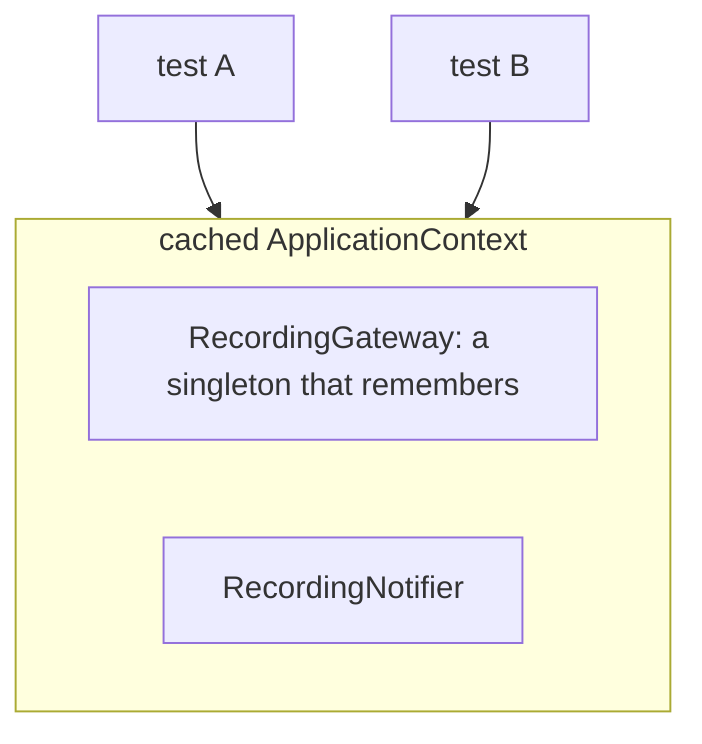

# Registry with Spring Pattern — Architecture Diagram

One context, cached and shared by every test with the same configuration.

Mermaid source

```mermaid
flowchart TB
    T1["test A"] --> C
    T2["test B"] --> C
    subgraph C["cached ApplicationContext"]
        G["RecordingGateway: a singleton that remembers"]
        N["RecordingNotifier"]
    end
```

