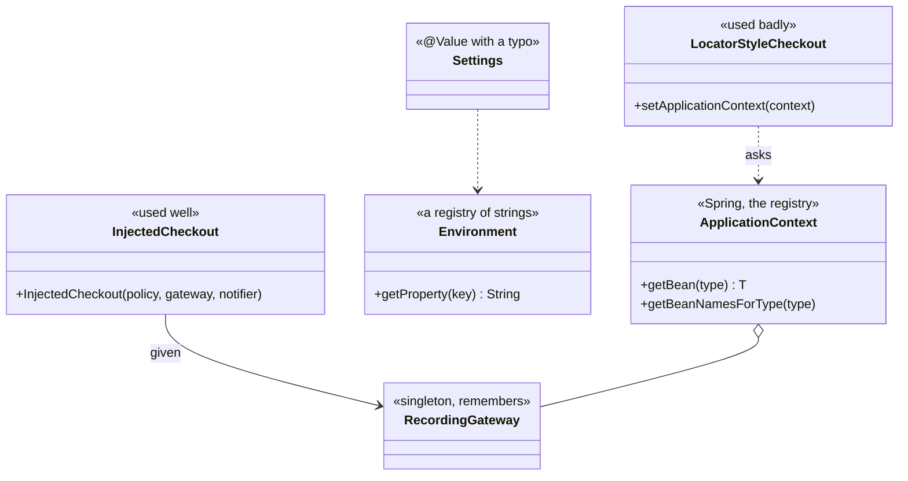

# Registry with Spring Pattern — Class Diagram

`ApplicationContext` is the registry. Two checkouts use it in opposite ways.

Mermaid source

```mermaid
classDiagram
    class ApplicationContext {
        <<Spring, the registry>>
        +getBean(type) T
        +getBeanNamesForType(type)
    }
    class Environment {
        <<a registry of strings>>
        +getProperty(key) String
    }
    class InjectedCheckout {
        <<used well>>
        +InjectedCheckout(policy, gateway, notifier)
    }
    class LocatorStyleCheckout {
        <<used badly>>
        +setApplicationContext(context)
    }
    class RecordingGateway {
        <<singleton, remembers>>
    }
    class Settings {
        <<@Value with a typo>>
    }
    InjectedCheckout --> RecordingGateway : given
    LocatorStyleCheckout ..> ApplicationContext : asks
    ApplicationContext o-- RecordingGateway
    Settings ..> Environment
```

