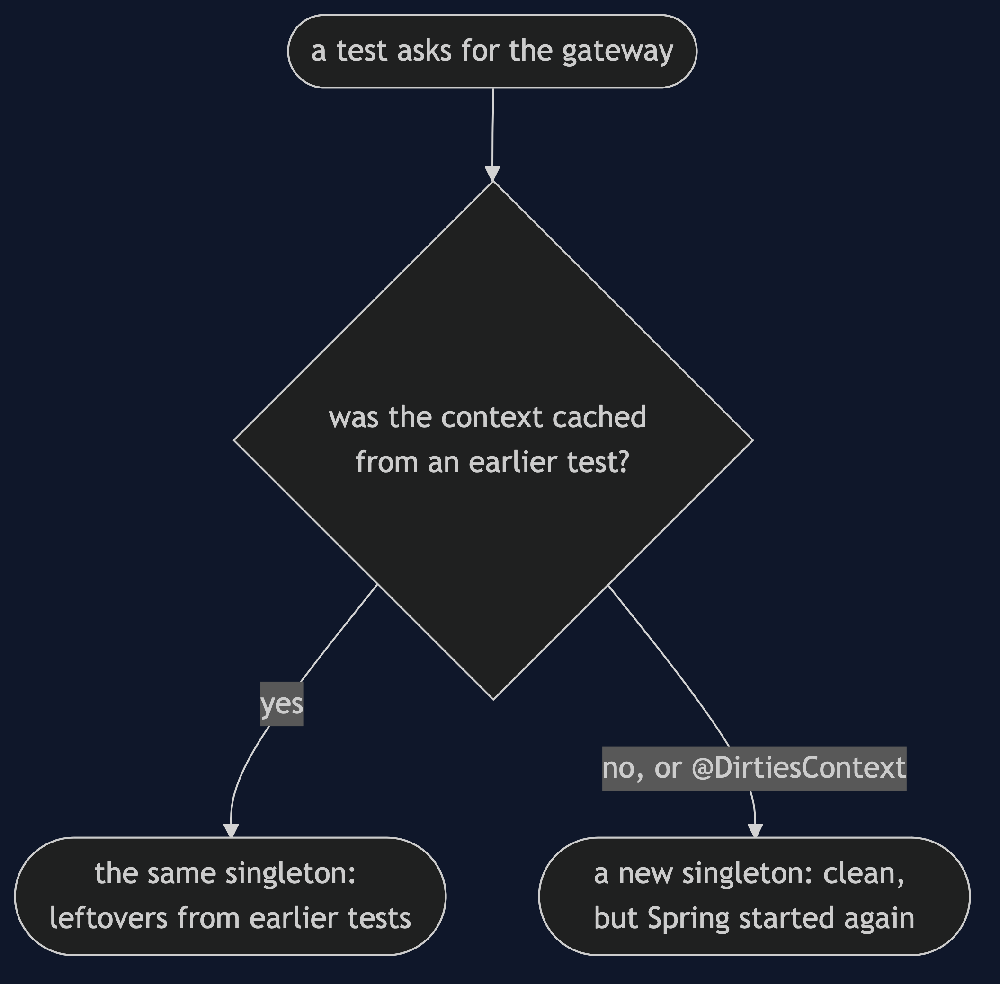
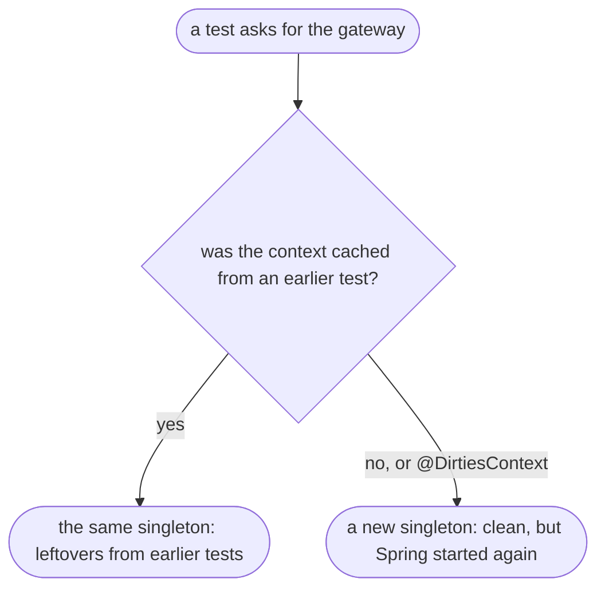

# Registry with Spring Pattern — Data Flow Diagram

A test's view of a singleton, with and without a fresh context.

Mermaid source

```mermaid
flowchart TD
    Start(["a test asks for the gateway"])
    Cached{"was the context cached from an earlier test?"}
    Old(["the same singleton: leftovers from earlier tests"])
    New(["a new singleton: clean, but Spring started again"])
    Start --> Cached
    Cached -- yes --> Old
    Cached -- no, or @DirtiesContext --> New
```

