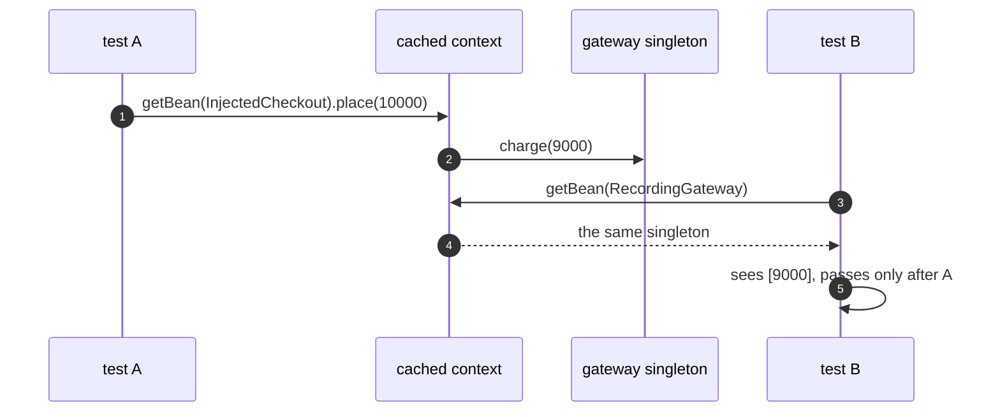

# Registry with Spring Pattern — Sequence Diagram

Written for a listener with the screen off.

Say it in words. Test A asks the shared context for the checkout and places an order, which charges the gateway once. The gateway is a singleton, so it now holds that charge. Test B then starts on the same cached context and expects a clean gateway. It asks for it, and gets the very same one, with the charge still on it. Test B passes only because test A ran first. Run alone, it would see nothing.

Mermaid source

The load-bearing sentence: **the registry done well still shares whatever it holds.**
