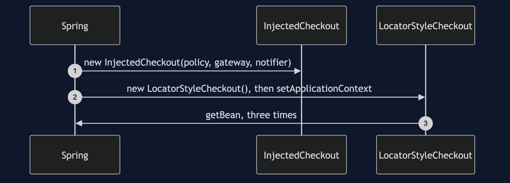
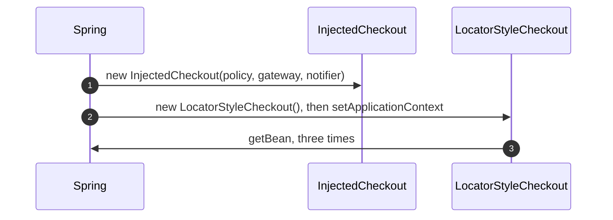
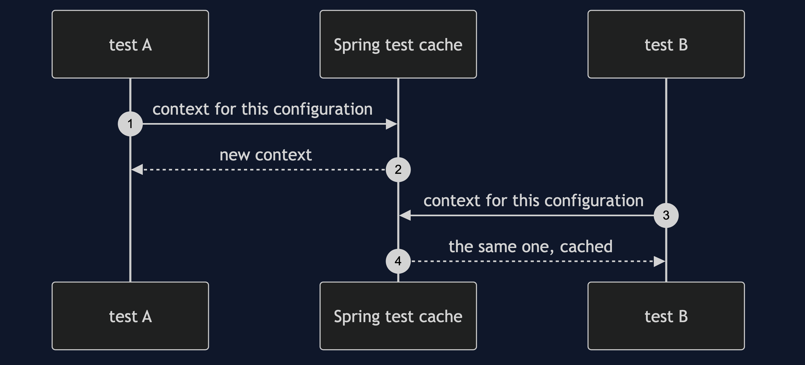
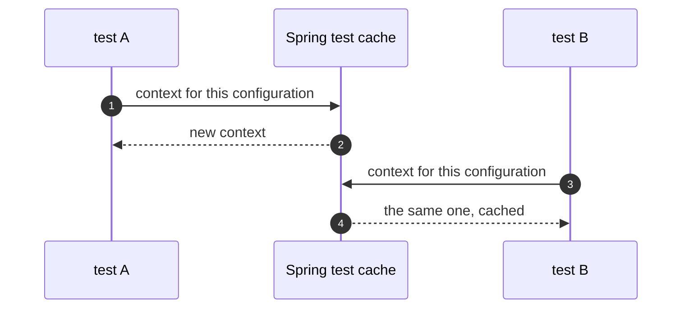
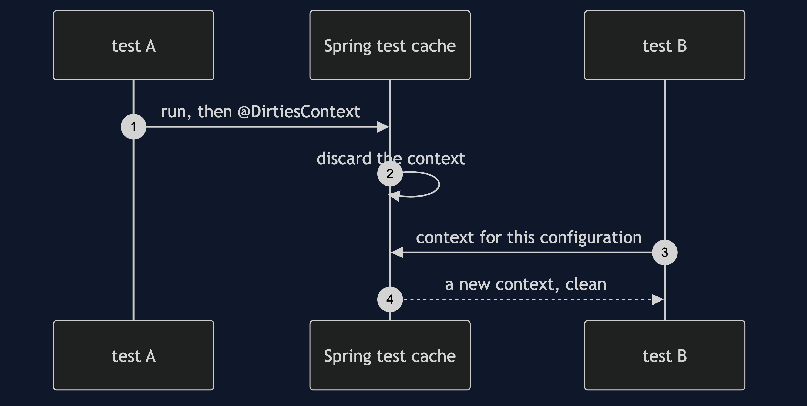
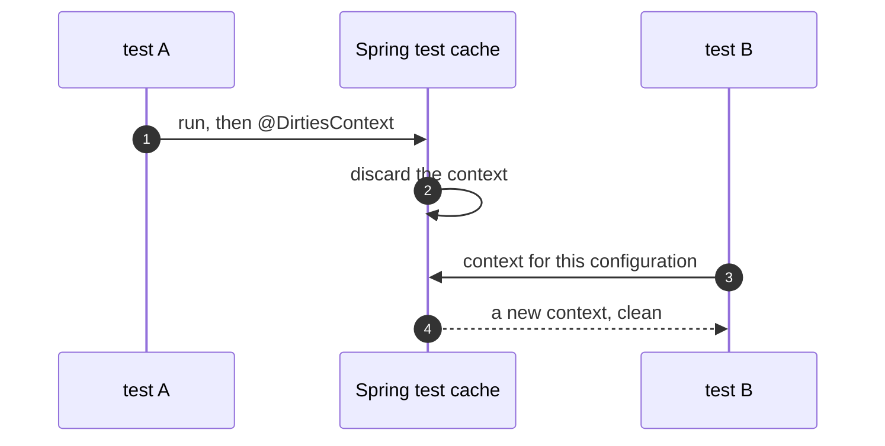
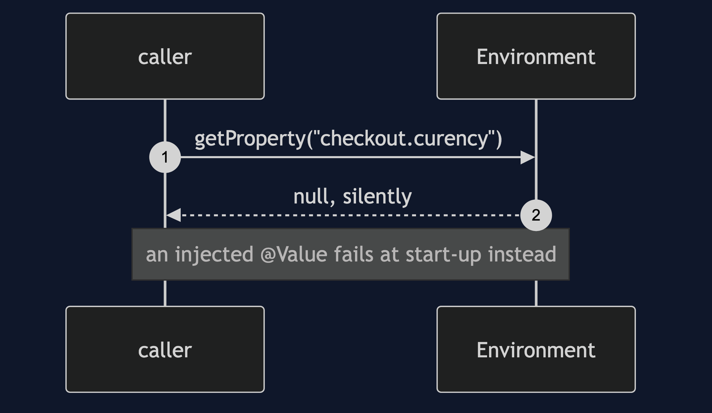
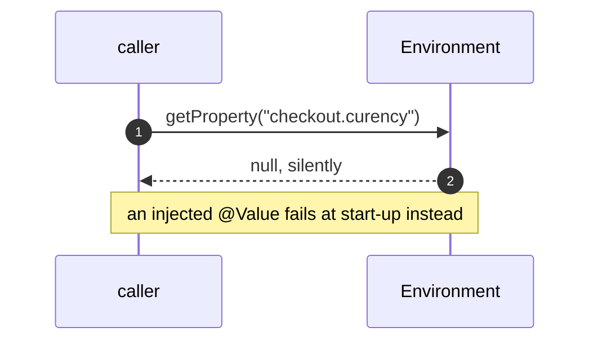

# Registry with Spring Pattern — UML Sequence Diagrams

Four sequences.

## 1. Injected Versus Asked

Mermaid source

## 2. The Cached Context

Mermaid source

## 3. DirtiesContext

Mermaid source

## 4. A Typo In A Property

Mermaid source

