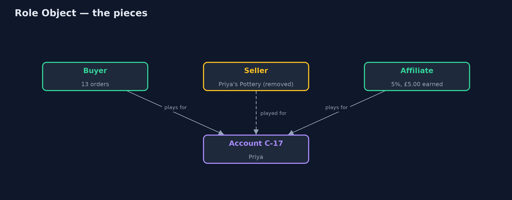
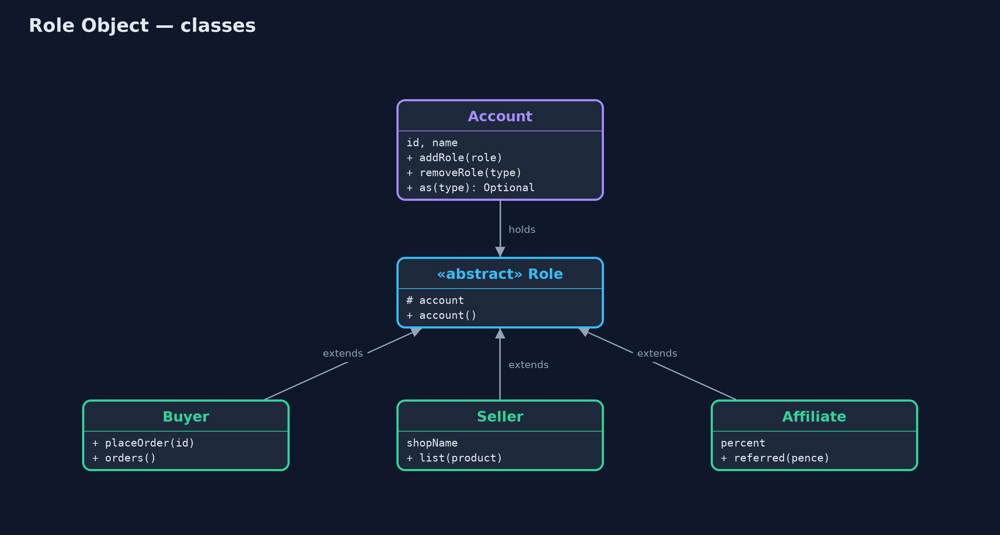
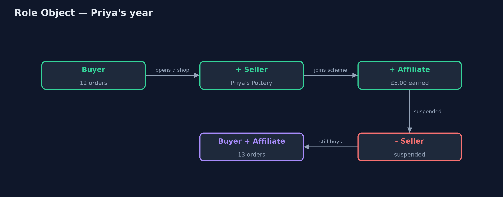
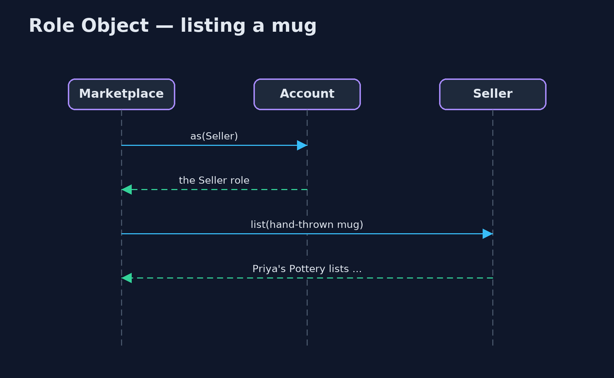

# Role Object Pattern

```
src/main/java/com/jk/explore/roleobject/
├── Account.java         The pattern's core: one account, one identity, that can take on and drop roles while it lives
├── Role.java            Something an account does for a while: buying, selling, referring
├── RoleObjectDemo.java  The five acts: a subclass per kind of customer, roles on one account, roles with behaviour, dropping a role, and the bill
├── Roles.java           The roles an account can play
└── Subclasses.java      Without the pattern: one subclass per kind of customer, fixed when the object is made
```

**Keep one core object for the identity, and model each thing it does for a while (buying, selling, referring) as a separate role object that can be added and removed.**

Role Object is a pattern for things that play different roles over their
lifetime. Instead of a subclass for every kind of customer, fixed when the
object is created, there is one core object that holds the identity, and a
separate role object for each thing it does for a while: a buyer role, a
seller role, an affiliate role. Roles are added and removed as life changes,
each with its own data and behaviour, while the identity stays the same.

## The idea in everyday terms

Think of one person who is a parent, a nurse, and a weekend football coach. It
is the same person all along. The hospital keeps a record of the nurse role,
the football club keeps a record of the coach role. When the person gives up
coaching, the club removes that role, and they are still a parent and still a
nurse. Nobody has to create a new person.

## The scenario

The online store's customers can also sell on its marketplace and join its
affiliate scheme. It modelled this with subclasses: `Customer`, and
`SellingCustomer extends Customer`. When Priya, with twelve orders, opened a
shop, the code created a new `SellingCustomer` object, and her order history
stayed behind on the old one.

## Run

```bash
./gradlew run
```

The demo tells the story in 5 acts, each printing exact numbers that the tests check:

| Act | What it shows |
| --- | --- |
| 1. A subclass per kind | Priya opens a shop and becomes a new SellingCustomer object with 0 orders; buyer, seller and affiliate in any mix need 7 classes. |
| 2. One account, many roles | Account C-17 plays Buyer and Seller; her 12 orders stay on the account. |
| 3. Roles with behaviour | The seller role lists a hand-thrown mug; the affiliate role earns 5% of £40 and £60 referrals: £5.00. |
| 4. Dropping a role | Selling is suspended: the Seller role is removed, listing is refused, and she can still buy (13 orders). |
| 5. The bill | Every use of a role starts with as(...) and a plan for "no"; her data is spread across the account and roles. |

## Test

```bash
./gradlew test
```

8 tests in `AccountTest`, `DemoRunsTest`. Every number the demo prints is asserted, and nothing depends on the clock, so every run gives the same result.

## Technologies and versions

| Technology | Version | Used for |
| --- | --- | --- |
| Java | 21 | the code (toolchain set in `build.gradle`) |
| Gradle | 9.2.1 (wrapper) | build and run, nothing to install |
| JUnit | 5.10.2 | the tests |
| videokit | repository tool | the narrated video and animation: Piper `en_US-amy-medium`, speed 0.8, longer pauses (the approved `amy-slow` voice) |

## Learning Material

| Document | What it is for |
| --- | --- |
| [Problem statement](docs/problem-statement.md) | the situation and what the project must show |
| [Prerequisites](docs/prerequisites.md) | what you need to know first |
| [Role Object, explained](docs/role-object-pattern-explained.md) | the acts in prose |
| [Session guide](docs/session.md) | a one-hour lesson with exercises |
| [Animated walkthrough](docs/animation.html) | the acts step by step, narrated |
| [Spec](docs/spec.md) | what this project must be true of |

### The pattern in one picture

One account, with roles that come and go.



### Where each piece sits

Roles extend one small base class and point back at their account.



### How the data moves

The account stays; roles arrive and leave.



### Who calls whom, in order

Ask for the role, then use it.



### Video

`video/role-object-pattern-explained.mp4` (with `.m4a` audio and `.srt` subtitles) is built by `video/build_video.sh`. Rendered media is not committed.

## What it costs

- **Ask before use.** Every use of a role starts with `as(...)` and a plan for "no".
- **Data is spread out.** The name is on the account, the shop name on a role; when the role goes, so does its data.
- **Identity questions.** Code must compare accounts, not roles, to know whether two things are the same person.

## When this is too much

When an object's kind never changes during its life, and there are only a
couple of kinds, a subclass or a simple field is clearer. Role objects pay off
when roles come and go, combine freely, and bring their own data and
behaviour.

## Where you have already met this

- User accounts with roles such as customer, seller and admin in marketplaces.
- Party and PartyRole models in enterprise data, where a person or company plays customer, supplier and employee.
- Actors and their roles in UML and in games.

## Where this sits

This project is in [foundational-design-patterns](..), next to
[Extension Object](../extension-object-pattern), a close cousin that attaches
extra data to an object. Role Object focuses on roles with their own behaviour
that come and go over the object's life.
