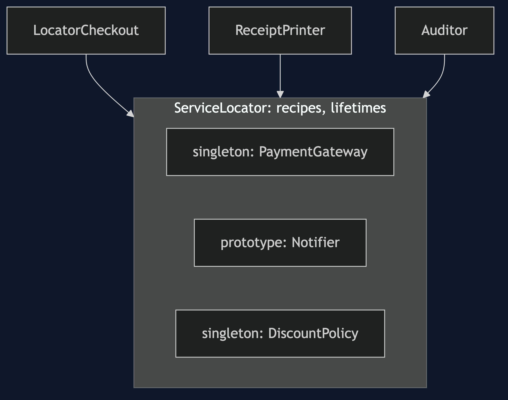
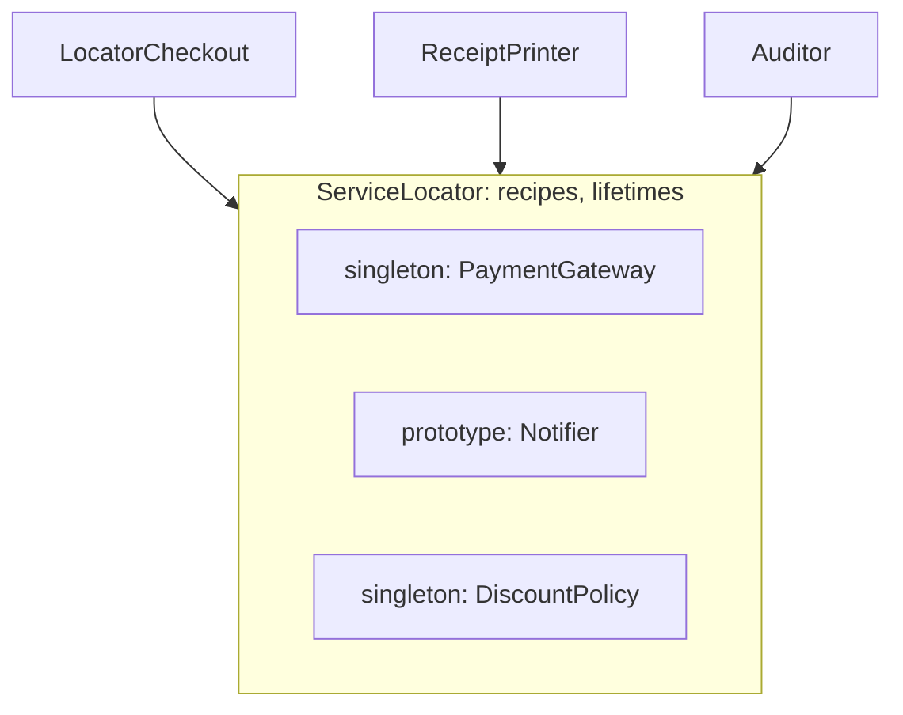

# Service Locator Pattern — Architecture Diagram

Every class asks the locator. The locator holds recipes.

Mermaid source

```mermaid
flowchart TB
    A["LocatorCheckout"] --> L
    B["ReceiptPrinter"] --> L
    C["Auditor"] --> L
    subgraph L["ServiceLocator: recipes, lifetimes"]
        R1["singleton: PaymentGateway"]
        R2["prototype: Notifier"]
        R3["singleton: DiscountPolicy"]
    end
```

