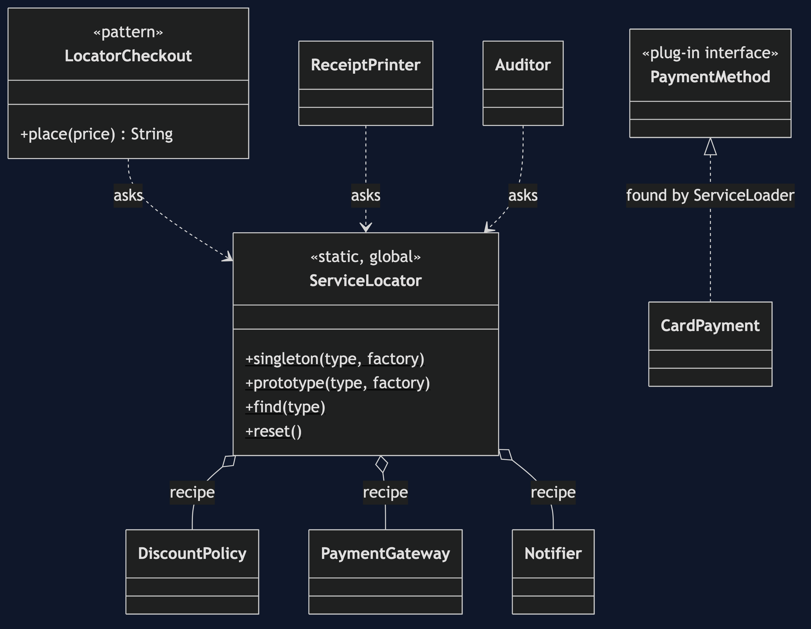
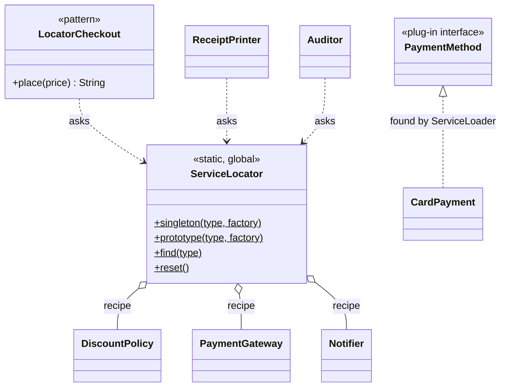

# Service Locator Pattern — Class Diagram

Three classes ask `ServiceLocator`. It knows recipes, not just things.

Mermaid source

```mermaid
classDiagram
    class ServiceLocator {
        <<static, global>>
        +singleton(type, factory)$
        +prototype(type, factory)$
        +find(type)$
        +reset()$
    }
    class LocatorCheckout {
        <<pattern>>
        +place(price) String
    }
    class ReceiptPrinter
    class Auditor
    class DiscountPolicy
    class PaymentGateway
    class Notifier
    class PaymentMethod {
        <<plug-in interface>>
    }
    LocatorCheckout ..> ServiceLocator : asks
    ReceiptPrinter ..> ServiceLocator : asks
    Auditor ..> ServiceLocator : asks
    ServiceLocator o-- DiscountPolicy : recipe
    ServiceLocator o-- PaymentGateway : recipe
    ServiceLocator o-- Notifier : recipe
    PaymentMethod <|.. CardPayment : found by ServiceLoader
```

