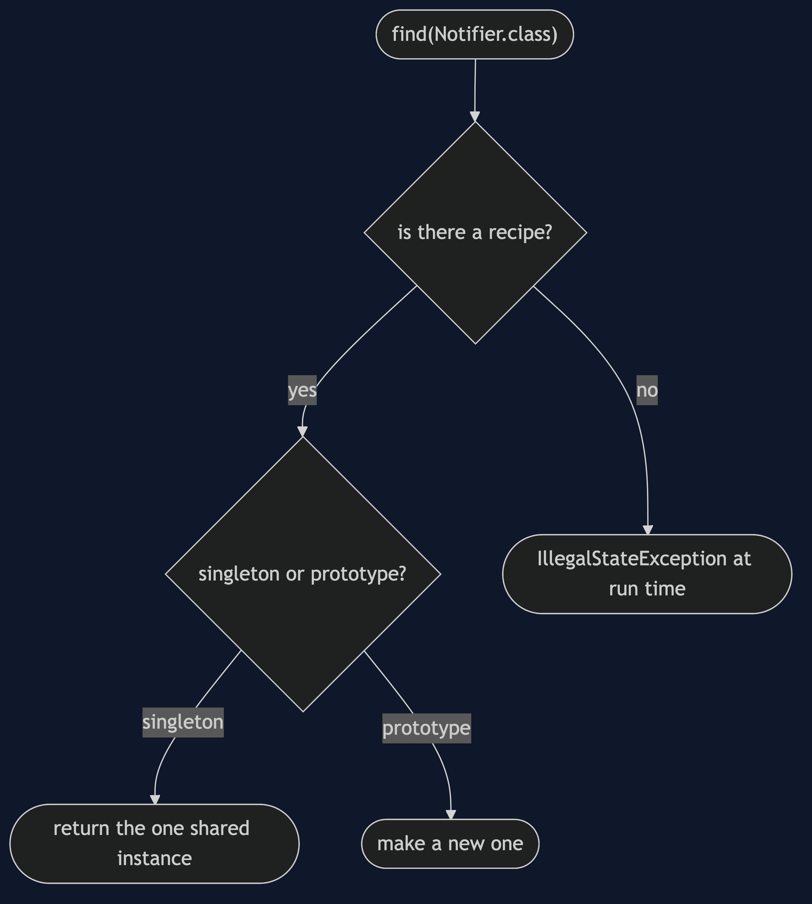
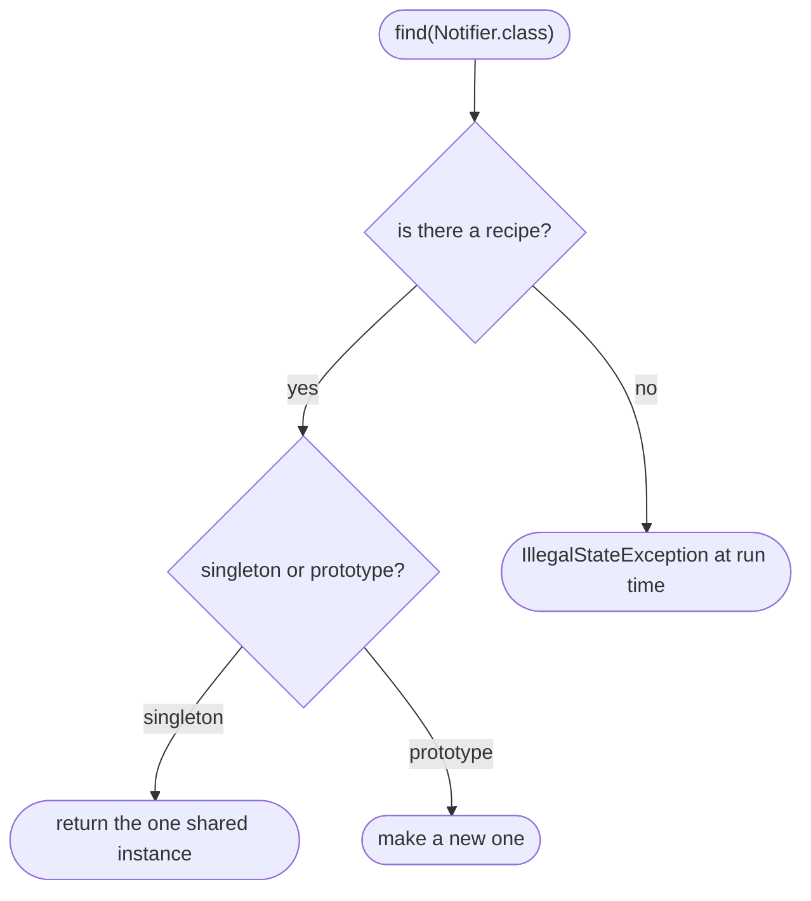

# Service Locator Pattern — Data Flow Diagram

One `find`: created, reused, or a failure the compiler did not warn about.

Mermaid source

```mermaid
flowchart TD
    Ask(["find(Notifier.class)"])
    Has{"is there a recipe?"}
    Kind{"singleton or prototype?"}
    Cached(["return the one shared instance"])
    New(["make a new one"])
    Fail(["IllegalStateException at run time"])
    Ask --> Has
    Has -- no --> Fail
    Has -- yes --> Kind
    Kind -- singleton --> Cached
    Kind -- prototype --> New
```

