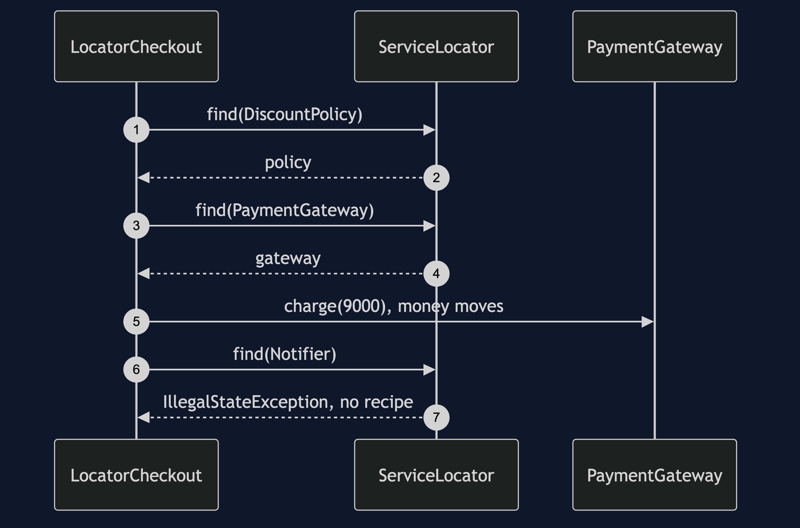
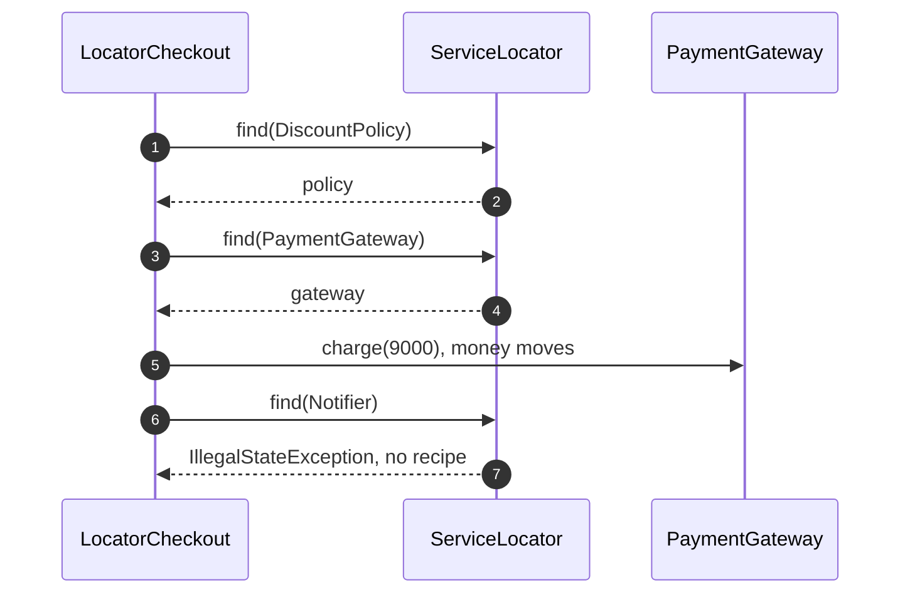

# Service Locator Pattern — Sequence Diagram

Written for a listener with the screen off.

Say it in words. The checkout asks the locator for the discount policy, and gets it. It asks for the payment gateway and charges the customer. Then it asks for the notifier, and the locator has no recipe for it, because somebody forgot to configure it. The locator throws. The customer has already been charged. Nothing in the checkout's constructor or in the build could have warned anyone.

Mermaid source

The load-bearing sentence: **the failure arrived in production, after the money moved, not in the build.**
